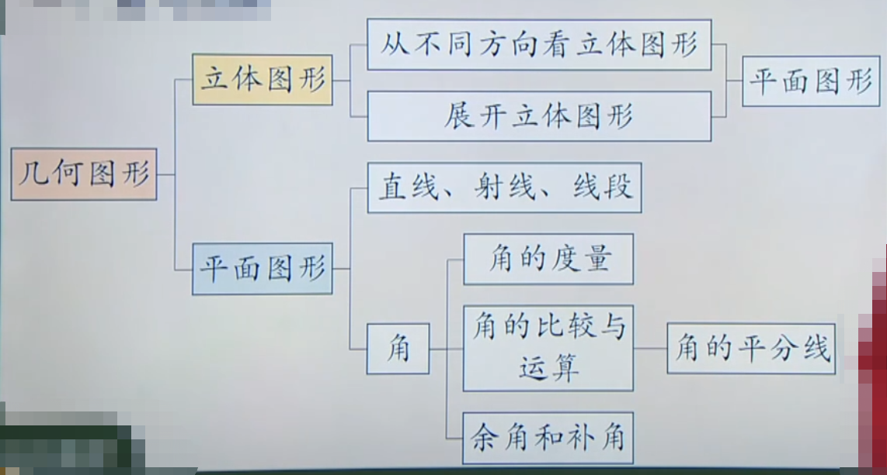

# 几何图形
长方体、圆柱、球、圆锥、棱锥、圆、长（正）方形、线段、点等，都是从形形色色的物体外形中得出的，它们都是几何图形，是数学研究的主要对象之一

## 立体图形 
有些几何图形（如长方体、正方体、圆柱、圆锥、球等） 的各部分不都在同一个平面内，它们是立体图形

## 平面图形 
有些几何图形（如线段、角、三角形、长方形） 的各部分都在同一个平面内，它们是平面图形

立体图形与平面图形是两类不同的几何图形，但是它们是互相联系的。 立体图形中**某些部分**是平面图形。

## 物体的形状
1. 确定物体的形状特征要从三个方向（正面、上面、左面）观察
2. 对于一些立体图形的问题，常把它们转化为平面图形来研究和处理。体现了数学中的转化思想

## 展开图
立体图形是由一些平面图形围成的，将它们的表面适当剪开，展成平面图形．这样的平面图形称为相应立体图形的展开图。

## 组成
几何图形是由点、线、面、体构成的，点是构成图形的基本元素

点、线、面、体之间点关系：
```
     点动成线        线动成面         面动成体
   ----------->    ----------->    ----------->
点              线              面               体
   <-----------    <-----------    <-----------
    线与线相交       面与面相交        包围着体
```
# 直线与线段
## 基本事实
经过两点有一条直线，且只有一条直线（两点确定一条直线）

A、B两点的所有连线中，线段最短

## 直线、射线、线段的表示方法
1. 用一个小写英文字母表示，如直线l，线段a，射线l
2. 用线上的两个点表示，如直线AB(BA),线段AB(BA),射线OA(第一个点表示端点)

## 线段比较
1. 度量法
2. 叠合法

## 尺规作图
作一条线段等于已知线段（尺规作图） 

尺规作图： 在数学中，常限定用无刻度的直尺和圆规作图，这就是尺规作图。

## 两点的距离
连接两点间的线段的长度，叫做这两点的距离

## 线段的中点

# 角
## 定义
角的静态定义：有公共端点的两条射线组成的图形叫做角

角的动态定义：角是由一条射线绕着它的端点旋转而形成的图形

## 表示方法
1. 大写英文字母，如 &ang;AOB，&ang;O
2. 小写希腊字母，如 &ang;α
3. 数字，如 &ang;1

## 角的度量
以度、分、秒为单位的度量制叫角度制。 角的度、分、秒是六十进制的。 

## 角的换算
1周角=360°，1平角=180°，1°=60'，1'=60"，1°=3600"

## 角的大小比较
1. 度量法
2. 叠合法

## 数学思想
在结合实际生活情境抽象图形的过程中，发现了角的图形特征；在角的知识的学习过程中，类比了直线、射线、线段的学习经验。

## 角的和差运算
角的和或差仍然是一个角

## 角的平分线
### 定义及其三种语言
定义(文字语言)：从一个角的顶点出发，把这个角分成相等的两个角的射线，叫做这个角的平分线
> 注意：角平分线是一条射线

图形语言

符号语言

## 余角
和为90°的两个角互为余角

同角（等角）的余角相等

## 补角
和为180°的两个角互为补角

同角（等角）的补角相等

# 总结
