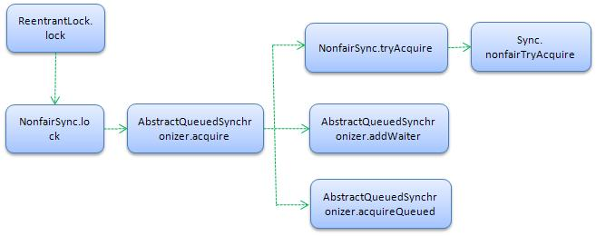

[TOC]

# 锁的基本原理

与synchronized不同，Lock完全用Java写成，在java这个层面是无关JVM实现的。在java.util.concurrent.lock包中有很多Lock的实现类，常用的有ReentrantLock、ReadWriteLock（实现类ReentrantReadWriteLock），其实现都依赖java.util.concurrent.AbstractQueuedSynchronizer类，实现思路都大同小异，因此我们以ReentrantLock作为讲解切入点。

#### ReentrantLock的调用过程

经过观察ReentrantLock把所有Lock接口的操作都委派到一个Sync类上，该类继承了AbstractQueuedSynchronizer：static abstract class Sync extends AbstractQueuedSynchronizer

Sync又有两个子类：

```
final static class NonfairSync extends Sync
final static class FairSync extends Sync
```

显然是为了支持公平锁和非公平锁而定义，默认情况下为非公平锁。

先理一下Reentrant.lock()方法的调用过程（默认非公平锁）：



Template模式导致很难直观的看到整个调用过程，其实通过上面调用过程及AbstractQueuedSynchronizer的注释可以发现，AbstractQueuedSynchronizer中抽象了绝大多数Lock的功能，而只把tryAcquire方法延迟到子类中实现。tryAcquire方法的语义在于用具体子类判断请求线程是否可以获得锁，无论成功与否AbstractQueuedSynchronizer都将处理后面的流程。

#### Lock VS Synchronized

1. AbstractQueuedSynchronizer通过构造一个基于阻塞的CLH队列(自旋锁,能确保无饥饿性,提供先来先服务的公平性)容纳所有的阻塞线程，而对该队列的操作均通过Lock-Free（CAS）操作，但对已经获得锁的线程而言，ReentrantLock实现了偏向锁的功能。
2. synchronized的底层也是一个基于CAS操作的等待队列，但JVM实现的更精细，把等待队列分为ContentionList和EntryList，目的是为了降低线程的出列速度；当然也实现了偏向锁，从数据结构来说二者设计没有本质区别。但synchronized还实现了自旋锁，并针对不同的系统和硬件体系进行了优化，而Lock则完全依靠系统阻塞挂起等待线程。
3. 当然Lock比synchronized更适合在应用层扩展，可以继承AbstractQueuedSynchronizer定义各种实现，比如实现读写锁（ReadWriteLock），公平或不公平锁；同时，Lock对应的Condition也比wait/notify要方便的多、灵活的多。synchronized使用的内置锁和ReentrantLock这种显式锁在java6以后性能没多大差异，在更新的版本中内置锁只会比显式锁性能更好。这两种锁都是独占锁，java5以前内置锁性能低的原因是它没做任何优化，直接使用系统的互斥体来获取锁。显式锁除了CAS的时候利用的是本地代码以外，其它的部分都是Java代码实现的，在后续版本的Java中，显式锁不太可能会比内置锁好，只会更差。使用显式锁的唯一理由是要利用它更多的功能。


​		
​		


2-synchronized的缺陷
	1、我们知道，可以利用synchronized关键字来实现共享资源的互斥访问。Java 5在java.util.concurrent.locks包下提供了另一种来实现线程的同步访问，那就是Lock。既然有了synchronized来实现线程同步，Java为什么还需要提供Lock呢？
	synchronized是Java的一个关键字，当我们使用synchronized来修饰方法或代码块时，线程必须先获得对应的锁才能执行该段代码。而其他线程只能一直等待，直到当前线程释放锁并获得对应的锁才能进入该段代码。这里获取锁的线程释放锁只会有两种情况：
		获取锁的线程执行完该段代码，线程会释放占有的锁；
		线程执行发生异常，此时JVM会让线程自动释放锁。
	那么如果这个占有锁的线程由于等待IO或其他原因（比如调用sleep方法）被阻塞，但是还没有释放锁，那么其他线程只能干巴巴的等着，试想这多么影响程序的执行效率。
	2、当多个线程同时读写文件是，我们知道读操作和写操作会发生冲突，写操作和写操作也会发生冲突，但是读操作和读操作之间不会冲突。synchronized关键字对一段代码加锁，所有的线程必须先获得对应的锁才有该代码段的执行权限。如果多个线程同时进行读操作时，使用synchronized关键字会导致在任何时刻只有一个线程读，其他线程等待，大大降低执行效率。
	Lock可以对以上种种情况作优化，提供更好的执行效率。另外，Lock方便了对锁的管理，可以自由的加锁和释放锁，还可以判断有没有成功获取锁。但是在使用Lock时要注意，Lock需要开发者手动去释放锁，如果没有主动释放锁，就要可能导致死锁出现。建议在finally语句块中释放Lock锁。
3-concurrent.locks包下常用类
	1、首先要说明的是Lock，它是一个接口：
		public interface Lock {  
		    void lock();  
		    void lockInterruptibly() throws InterruptedException;  
		    boolean tryLock();  
		    boolean tryLock(long time, TimeUnit unit) throws InterruptedException;  
		    void unlock();  
		    Condition newCondition();  
		}  
	lock()方法用来获取锁。
	tryLock()尝试获取锁，如果成功则返回true，失败返回false（其他线程已占有锁）。这个方法会立即返回，在拿不到锁时也不会等待。
	tryLock(long time, TimeUnit unit)方法和tryLock()方法类似，只不过在拿不到锁时等待一定的时间，如果超过等待时间还拿不到锁就返回false。
	lockInterruptibly()方法比较特殊，当通过这个方法获取锁时，如果该线程正在等待获取锁，则它能够响应中断。也就是说，当两个线程同时通过lockInterruptibly()获取某个锁时，假如线程A获得了锁，而线程B仍在等待获取锁，那么对线程B调用interrupt()方法可以中断B的等待过程。
	2、lock的使用：
		// lock()的使用  
		Lock lock = ...;  
		lock.lock();  
		try{  
		    //处理任务  
		}catch(Exception ex){  
		       

		}finally{  
		    lock.unlock();   //释放锁  
		}  
	3、tryLock的使用
		// tryLock()的使用  
		Lock lock = ...;  
		if(lock.tryLock()) {  
		     try{  
		         //处理任务  
		     }catch(Exception ex){  
		           
		     }finally{  
		         lock.unlock();   //释放锁  
		     }   
		}else {  
		    //如果不能获取锁，则直接做其他事情  
		}  
	4、lockInterruptibly()的使用
		// lockInterruptibly()的使用  
		public void method() throws InterruptedException {  
		    lock.lockInterruptibly();  
		    try {    
		     //.....  
		    }  
		    finally {  
		        lock.unlock();  
		    }    
		} 
		使用synchronized关键字，当线程处于等待锁的状态时，是无法被中断的，只能一直等待。
4-ReentrantLock
	ReentrantLock是可重入锁。如果所具备可重入性，则称为可重入锁，synchronized可ReentrantLock都是可重入锁。可重入锁也叫递归锁，当一个线程已经获得该代码块的锁时，再次进入该代码块不必重新申请锁，可以直接执行。 
	例1， lock()的使用方法：
		public class Test {  
		    private ArrayList<Integer> arrayList = new ArrayList<Integer>();  
		    private Lock lock = new ReentrantLock();    //注意这个地方  
		    public static void main(String[] args)  {  
		        final Test test = new Test();     
		        new Thread(){  
		            public void run() {  
		                test.insert(Thread.currentThread());  
		            };  
		        }.start();  
		           
		        new Thread(){  
		            public void run() {  
		                test.insert(Thread.currentThread());  
		            };  
		        }.start();  
		    }       
		    public void insert(Thread thread) {  
		        lock.lock();  
		        try {  
		            System.out.println(thread.getName()+"得到了锁");  
		            for(int i=0;i<5;i++) {  
		                arrayList.add(i);  
		            }  
		        } catch (Exception e) {  
		            // TODO: handle exception  
		        }finally {  
		            System.out.println(thread.getName()+"释放了锁");  
		            lock.unlock();  
		        }  
		    }  
		} 
	例2， lockInterruptibly()响应中断的使用方法：
		public class Test {  
		    private Lock lock = new ReentrantLock();     
		    public static void main(String[] args)  {  
		        Test test = new Test();  
		        MyThread thread1 = new MyThread(test);  
		        MyThread thread2 = new MyThread(test);  
		        thread1.start();  
		        thread2.start();  
		        try {  
		            Thread.sleep(2000);  
		        } catch (InterruptedException e) {  
		            e.printStackTrace();  
		        }  
		        thread2.interrupt();  
		    }       
		    public void insert(Thread thread) throws InterruptedException{  
		        lock.lockInterruptibly();   //注意，如果需要正确中断等待锁的线程，必须将获取锁放在外面，然后将InterruptedException抛出  
		        try {    
		            System.out.println(thread.getName()+"得到了锁");  
		            long startTime = System.currentTimeMillis();  
		            for(    ;     ;) {  
		                if(System.currentTimeMillis() - startTime >= Integer.MAX_VALUE)  
		                    break;  
		                //插入数据  
		            }  
		        }  
		        finally {  
		            System.out.println(Thread.currentThread().getName()+"执行finally");  
		            lock.unlock();  
		            System.out.println(thread.getName()+"释放了锁");  
		        }    
		    }  
		}     
		class MyThread extends Thread {  
		    private Test test = null;  
		    public MyThread(Test test) {  
		        this.test = test;  
		    }  
		    @Override  
		    public void run() {  
		           
		        try {  
		            test.insert(Thread.currentThread());  
		        } catch (InterruptedException e) {  
		            System.out.println(Thread.currentThread().getName()+"被中断");  
		        }  
		    }  
		}
	打印结果：
		如果Thread-1得到了锁 Thread-0不中断
			结果：Thread-1得到了锁 
		如果Thread-0得到了锁 Thread-1不中断
			结果：Thread-0得到了锁
				  Thread-1被中断
5-ReadWriteLock 读写锁：分为读锁和写锁，多个读锁不互斥，读锁和写锁互斥，写锁和写锁互斥，这是由jvm自己控制的
	ReadWriteLock也是一个接口，它只定义了两个方法：
		public interface ReadWriteLock {  
		    /** 
		     * Returns the lock used for reading. 
		     */  
		    Lock readLock();  
		   
		    /** 
		     * Returns the lock used for writing. 
		     */  
		    Lock writeLock();  
		}  
	readLock()用来获取读锁，writeLock()用来获取写锁。也就是将文件的读写操作分开，分成两个锁来分配给线程，从而使多个线程可以同时进行读操作。ReentrantReadWriteLock是它的实现类。
		public class Test {
			private ReentrantReadWriteLock rwl = new ReentrantReadWriteLock();   
		    public static void main(String[] args)  {  
		        final Test test = new Test();   
		        new Thread(){  
		            public void run() {  
		                test.get(Thread.currentThread());  
		            };  
		        }.start();  
		        new Thread(){  
		            public void run() {  
		                test.get(Thread.currentThread());  
		            };  
		        }.start();  
		           
		    }      
		    public void get(Thread thread) {  //读操作上读锁，写操作上写锁
		//        rwl.writeLock().lock(); 
		    	rwl.readLock().lock();
		        try {  
		            long start = System.currentTimeMillis();    
		            for(int i=0; i<5; i++) {  
		                System.out.println(thread.getName()+"正在进行读操作");
		                try {
							Thread.sleep(1000);
						} catch (InterruptedException e) {
							e.printStackTrace();
						}
		            }  
		            System.out.println(thread.getName()+"读操作完毕");  
		        } finally {  
		//            rwl.writeLock().unlock(); 
		        	rwl.readLock().unlock(); 
		        }  
		    }  
		}
	API文档中一个缓存数据的接口：
		示例用法。下面的代码展示了如何利用重入来执行升级缓存后的锁降级（为简单起见，省略了异常处理）： 
			 class CachedData {
			   Object data;
			   volatile boolean cacheValid;
			   ReentrantReadWriteLock rwl = new ReentrantReadWriteLock();
	
			   void processCachedData() {
				 rwl.readLock().lock();
				 if (!cacheValid) {
					// Must release read lock before acquiring write lock
					rwl.readLock().unlock();
					rwl.writeLock().lock();
					// Recheck state because another thread might have acquired
					//   write lock and changed state before we did.
					if (!cacheValid) {
					  data = ...
					  cacheValid = true;
					}
					// Downgrade by acquiring read lock before releasing write lock
					rwl.readLock().lock();
					rwl.writeLock().unlock(); // Unlock write, still hold read
				 }
	
				 use(data);
				 rwl.readLock().unlock();
			   }
			 }

