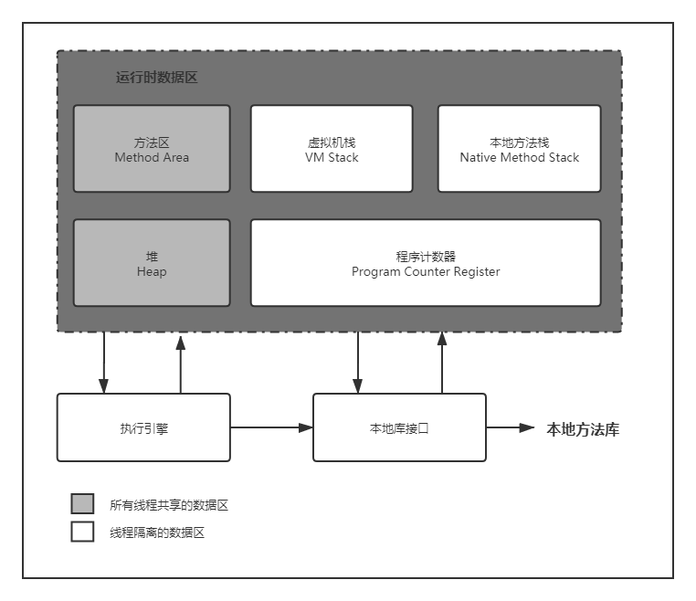
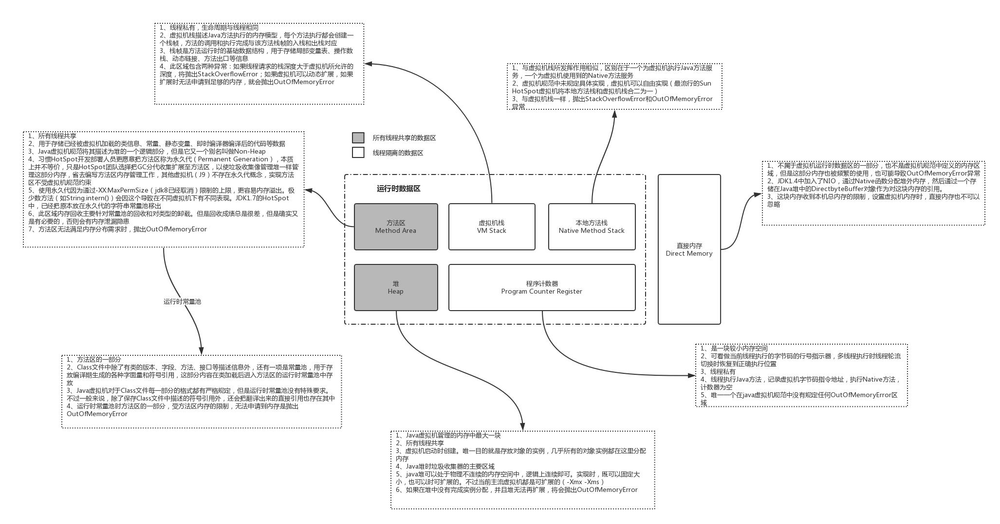
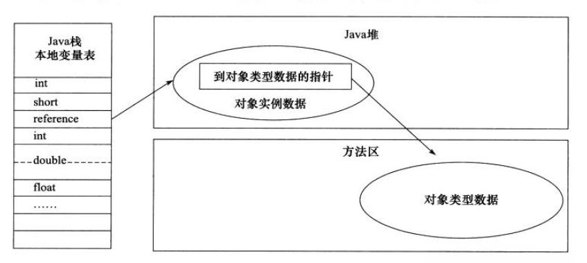
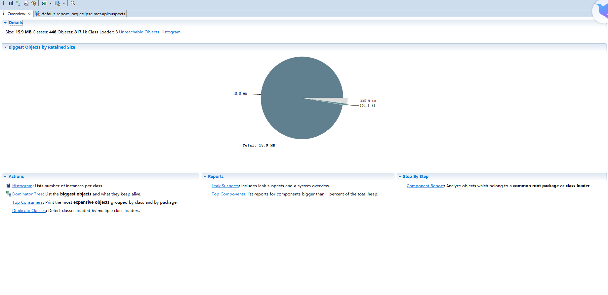

[TOC]

Java与C++之间有一堵由内存动态分配和垃圾收集技术所围成的“高墙”，墙外面的人想进去，墙里面的人却想出来。

# 概述

对C和C++的开发人员来说，在内存管理领域，他们既拥有每一个对象的“所有权”，也担负着每一个对象生命开始到终结的维护责任。

对java程序猿来说，在虚拟机自动内存管理机制的帮助下，不再需要为每一个new操作去写配对的delete/free代码，不容易出现内存泄露和内存溢出的问题。但是也出现问题：如果不理解虚拟机是怎么使用内存的，排查错误将会是一项非常艰难的工作。

# 运行时数据区

Java虚拟机在执行Java程序的过程中会把它所管理的内存划分为若干个不同的数据区域。这些区域都有各自的用途，以及创建和销毁的时间，有的区域随着虚拟机进程的启动而存在，有些区域则依赖用户线程的启动和结束而建立和销毁。根据《Java虚拟机规范（Java SE 7版）》的规定，Java虚拟机所管理的内存将会包括以下几个运行时数据区域，如下图所示。



#### 程序计数器

1. 是一块较小内存空间
2. 可看做当前线程执行的字节码的行号指示器，多线程执行时线程轮流切换时恢复到正确执行位置
3. 线程私有
4. 线程执行Java方法，记录虚拟机字节码指令地址，执行Native方法，计数器为空
5. 唯一一个在java虚拟机规范中没有规定任何OutOfMemoryError区域

#### Java虚拟机栈

1. 线程私有，生命周期与线程相同
2. 虚拟机栈描述Java方法执行的内存模型，每个方法执行都会创建一个栈帧，方法的调用和执行完成与该方法栈帧的入栈和出栈对应
3. 栈帧是方法运行时的基础数据结构，用于存储局部变量表、操作数栈、动态链接、方法出口等信息
4. 常说的栈内存，所指的就是虚拟机栈，或者说是虚拟机栈中的局部变量表部分，局部变量表部分存放了编译器可知的各种基本数据类型（boolean、byte、char、short、int、 float、long、double)、对象引用（reference类型，它不等同于对象本身，可能是一个指向对象起始地址的引用指针，也可能是指向一个代表对象的句柄或其他与此对象相关的位置）和 retumAddress类型（指向了一条字节码指令的地址）。其中64位长度的long和double类型的数据会占用2个局部变量空间（Slot)，其余的数据类型只占用1个。局部变量表所需的内存空间在编译期间完成分配，当进入一个方法时， 这个方法需要在帧中分配多大的局部变量空间是完全确定的，在方法运行期间不会改变局部变量表的大小。
5. 此区域包含两种异常：如果线程请求的栈深度大于虚拟机所允许的深度，将抛出StackOverflowError；如果虚拟机可以动态扩展，如果扩展时无法申请到足够的内存，就会抛出OutOfMemoryError

#### 本地方法栈

1. 与虚拟机栈所发挥作用相似，区别在于一个为虚拟机执行Java方法服务，一个为虚拟机使用到的Native方法服务
2. 虚拟机规范中未规定具体实现，虚拟机可以自由实现（最流行的Sun HotSpot虚拟机将本地方法栈和虚拟机栈合二为一）
3. 与虚拟机栈一样，抛出StackOverflowError和OutOfMemoryError异常

#### Java堆

1. Java虚拟机管理的内存中最大一块
2. 所有线程共享
3. 虚拟机启动时创建。唯一目的就是存放对象的实例，几乎所有的对象实例都在这里分配内存，但随着JIT编译器的发展与逃逸分析技术逐渐成熟，所有对象在堆上分配也不那么“绝对”了
4. Java堆时垃圾收集器的主要区域。从内存回收时角度来看，由于现在收集器基本都采用分代收集算法，所以Java堆中还可以细分为：新生代和老年代；再细致一点的有 Eden空间、From Survivor空间、To Survivor空间等。从内存分配的角度来看，线程共享的 Java堆中可能划分出多个线程私有的分配缓冲区（Thread Local Allocation Buffer，TLAB)。 不过无论如何划分，都与存放内容无关，无论哪个区域，存储的都仍然是对象实例；进一步划分的目的是为了更好回收内存，或者更快地分配内存。
5. java堆可以处于物理不连续的内存空间中，逻辑上连续即可。实现时，既可以固定大小，也可以是可扩展的。不过当前主流虚拟机都是可扩展的（-Xmx -Xms）
6. 如果在堆中没有完成实例分配，并且堆无法再扩展，将会抛出OutOfMemoryError

#### 方法区

1. 所有线程共享
2. 用于存储已经被虚拟机加载的类信息、常量、静态变量、即时编译器编译后的代码等数据
3. Java虚拟机规范将其描述为堆的一个逻辑部分，但是它有一个别名叫做Non-Heap，目的是与堆区分开来
4. 习惯HotSpot开发部署人员更愿意把方法区称为永久代（Permanent Generation），本质上并不等价，只是HotSpot团队选择把GC分代收集扩展至方法区，以使垃圾收集像管理堆一样管理这部分内存，省去编写方法区内存管理工作，其他虚拟机（J9）不存在永久代概念，实现方法区不受虚拟机规范约束
5. 使用永久代因为通过-XX:MaxPermSize（**jdk8已经取消**）限制的上限，更容易内存溢出。极少数方法（如String.intern()）会因这个导致在不同虚拟机下有不同表现。**JDK1.7的HotSpot中，已经把原本放在永久代的字符串常量池移出**
6. Java虚拟机规范对方法区限制十分宽松，除了和堆一样的不连续内存，大小可固定可扩展外，还可以选择不实现垃圾收集。相对而言，垃圾收集在这个区域是比较少出现的，但也不是“永久代”了。此区域内存回收主要针对常量池的回收和对类型的卸载。但是回收成绩总是很差，但是确实又是有必要的，否则会有内存泄漏隐患
7. 方法区无法满足内存分布需求时，抛出OutOfMemoryError

#### 运行时常量池

1. 方法区的一部分
2. Class文件中除了有类的版本、字段、方法、接口等描述信息外，还有一项是常量池，用于存放编译期生成的各种字面量和符号引用，这部分内容在类加载后进入方法区的运行时常量池中存放
3. Java虚拟机对于Class文件每一部分的格式都有严格规定，但是运行时常量池没有任何细节的要求。不过一般来说，除了保存Class文件中描述的符号引用外，还会把翻译出来的直接引用也存在其中
4. 运行时常量池相对于Class文件常量池的另外一个重要特征是具备动态性，Java语言并不要求常量一定只有编译期才能产生，也就是并非预置入Class文件中常量池的内容才能进入方法区运行时常量池，运行期间也可能将新的常量放人池中，这种特性被开发人员利用得比较多的便是String类的intern()方法。
5. 运行时常量池时方法区的一部分，受方法区内存的限制，无法申请到内存是抛出OutOfMemoryError

#### 直接内存

1. 不属于虚拟机运行时数据区的一部分，也不是虚拟机规范中定义的内存区域，但是这部分内存也被频繁的使用，也可能导致OutOfMemoryError异常
2. JDK1.4中加入了NIO，通过Native函数分配堆外内存，然后通过一个存储在Java堆中的DirectbyteBuffer对象作为对这块内存的引用。
3. 这块内存收到本机总内存的限制，设置虚拟机内存时，直接内存也不可以忽略

#### 总结



#### JDK1.8 补充

##### Perm永久代

绝大部分 Java 程序员应该都见过 "java.lang.OutOfMemoryError: PermGen space "这个异常。这里的 “PermGen space”其实指的就是方法区。不过**方法区和“PermGen space”又有着本质的区别**。前者是 JVM 的规范，而后者则是 JVM 规范的一种实现，并且只有 HotSpot 才有 “PermGen space”，而对于其他类型的虚拟机，如 JRockit（Oracle）、J9（IBM） 并没有“PermGen space”。由于方法区主要存储类的相关信息，所以对于动态生成类的情况比较容易出现永久代的内存溢出。最典型的场景就是，在 jsp 页面比较多的情况，容易出现永久代内存溢出。我们可以通过动态生成类来模拟 “PermGen space”的内存溢出。

##### Metaspace(元空间)

其实，**移除永久代的工作从JDK1.7就开始了**。JDK1.7中，**存储在永久代的部分数据就已经转移到了Java Heap或者是 Native Heap**。但永久代仍存在于JDK1.7中，并没完全移除，譬如符号引用(Symbols)转移到了native heap；字面量(interned strings)转移到了java heap；类的静态变量(class statics)转移到了java heap。

元空间的本质和永久代类似，都是对JVM规范中方法区的实现。不过元空间与永久代之间最大的区别在于：**元空间并不在虚拟机中，而是使用本地内存**。因此，**默认情况下，元空间的大小仅受本地内存限制**，但可以通过以下参数来指定元空间的大小：

- -XX:MetaspaceSize，初始空间大小，达到该值就会触发垃圾收集进行类型卸载，同时GC会对该值进行调整：如果释放了大量的空间，就适当降低该值；如果释放了很少的空间，那么在不超过MaxMetaspaceSize时，适当提高该值。
- -XX:MaxMetaspaceSize，最大空间，默认是没有限制的。

除了上面两个指定大小的选项以外，还有两个与 GC 相关的属性：

- -XX:MinMetaspaceFreeRatio，在GC之后，最小的Metaspace剩余空间容量的百分比，减少为分配空间所导致的垃圾收集
- -XX:MaxMetaspaceFreeRatio，在GC之后，最大的Metaspace剩余空间容量的百分比，减少为释放空间所导致的垃圾收集

# HotSpot虚拟机对象探秘

接下来，以常用的虚拟机HotSpot和常用的内存区域Java堆为例，深入探讨HotSpot虚拟机在Java堆中对象分配、布局和访问的全过程。

#### 对象的创建

Java是一门面向对象的编程语言，在Java程序运行过程中无时无刻都有对象被创建出来。在语言层面上，创建对象（例如克隆、反序列化）通常仅仅是一个new关键字而已，而在虚拟机中，对象（文中讨论的对象限于普通Java对象，不包括数组和Class对象等）的创建又是怎样一个过程呢？
虚拟机遇到一条new指令时：

1. **检查类加载**，首先将去检査这个指令的参数是否能在常量池中定位到一个类的符号引用，并且检査这个符号引用代表的类是否已被加载、解析和初始化过。如果没有，那必须先执行相应的类加载过程
2. **在类加载检査通过后，接下来虚拟机将为新生对象分配内存**。对象所需内存的大小在类加载完成后便可完全确定（如何确定将在下面介绍），为对象分配空间的任务等同于把一块确定大小的内存从Java堆中划分出来。假设Java堆中内存是绝对**规整**的，所有用过的内存都放在一边，空闲的内存放在另一边，中间放着一个指针作为分界点的指示器，那所分配内存就仅仅是把那个指针向空闲空间那边挪动一段与对象大小相等的距离，这种分配方式称为**“指针碰撞"**（Bump the Pointer)。如果Java堆中的内存并不是规整的，已使用的内存和空闲的内存相互交错，那就没有办法简单地进行指针碰撞了，虚拟机就必须维护一个列表，记录上哪些内存块是可用的，在分配的时候从列表中找到一块足够大的空间划分给对象实例，并更新列表上的记录，这种分配方式称为**“空闲列表”**（Free List）。选择哪种分配方式由Java堆是否规整决定，而Java堆是否规整又由所采用的**垃圾收集器是否带有压缩整理功能**决定。因此，在使用Serial、ParNew等带Compact过程的收集器时，系统采用的分配算法是指针碰撞，而使用CMS这种基于Mark-Sweep算法的收集器时，通常采用空闲列表。除如何划分可用空间之外，还有另外一个需要考虑的问题是对象创建在虚拟机中是非常频繁的行为，即使是仅仅修改一个指针所指向的位置。在并发情况下也并不是**线程安全**的。可能出现正在给对象A分配内存，指针还没来得及修改，对象B又同时使用了原来的指针来分配内存的情况。解决这个问题有两种方案，一种是对分配内存空间的动作进行同步处理——实际上虚拟机采用**CAS配上失败重试**的方式保证更新操作的原子性；另一种是把内存分配的动作按照线程划分在不同的空间之中进行,即每个线程在Java堆中预先分配一小块内存，称为**本地线程分配缓冲（Thread Local Allocation Buffer, TLA**）。哪个线程要分配内存， 就在哪个线程的TLAB上分配，只有TLAB用完并分配新的TLAB时，才需要同步锁定。虚拟机是否使用TLAB,可以通过-XX:+/-UseTLAB参数来设定。
3. 内存分配完成后，虚拟机需要将分配到的**内存空间都初始化为零值（不包括对象头）**， 如果使用TLAB,这一工作过程也可以提前至TLAB分配时进行。这一步操作保证了对象的实例字段在Java代码中可以不赋初始值就直接使用，程序能访问到这些字段的数据类型所对应的零值。
4. 接下来，虚拟机要**对对象进行必要的设置**，例如这个对象是哪个类的实例、如何才能找到类的元数据信息、对象的哈希码、对象的GC分代年龄等信息。这些信息存放在对象的对象头（Object Header)之中。根据虚拟机当前的运行状态知不同，如是否启用偏向锁等，对象头会有不同的设置方式。关于对象头的具体内容，稍后再做详细介绍。
5. 在上面工作都完成之后，**从虚拟机的视角来看，一个新的对象已经产生了**，但从Java程序的视角来看，对象创建才刚刚开始—— **< init > 方法还没有执行,所有的字段都还为零**。所 以,一般来说(由字节码中是否跟随invokespecial指令所决定),执行new指令之后会接着 执行< init >方法，把对象按照程序员的意愿进行初始化，这样一个真正可用的对象才算完全产生出来。
   

#### 对象的内存布局

在HotSpot虚拟机中，**对象在内存中存储的布局**可以分为3块区域：**对象头（Header)、 实例数据（Instance Data)和对齐填充（Padding)**。

HotSpot虚拟机的**对象头包括两部分信息**，**第一部分用于存储对象自身的运行时数据**， 如哈希码（HashCode)、GC分代年龄、锁状态标志、线程持有的锁、偏向线程ID、偏向时间戳等，这部分数据的长度在32位和64位的虚拟机（未开启压缩指针）中分别为32bit和 64bit,官方称它为“Mark Word”。对象需要存储的运行时数据很多，其实已经超出了 32位、 64位Bitmap结构所能记录的限度，但是对象头信息是与对象自身定义的数据无关的额外存储成本，考虑到虚拟机的空间效率，**Mark Word被设计成一个非固定的数据结构**以便在极小的空间内存储尽量多的信息，它会根据对象的状态复用自己的存储空间。例如，在32位的 HotSpot虚拟机中，如果对象处于未被锁定的状态下，那么Mark Word的32bit空间中的25bit 用于存储对象哈希码，4bit用于存储对象分代年龄，2bit用于存储锁标志位，1bit固定为0, 而在其他状态（轻量级锁定、重量级锁定、GC标记、可偏向）下对象的存储内容见表

| 存储内容                               | 标志位 | 状态               |
| -------------------------------------- | ------ | ------------------ |
| 对象哈希码、对象分代年龄               | 01     | 未锁定             |
| 指向锁记录的指针                       | 00     | 轻量级锁定         |
| 指向重量级锁的指针                     | 10     | 膨胀（重量级锁定） |
| 空，不需要记录信息                     | 11     | GC标记             |
| 偏向线程ID、偏向时间戳、对象分代年龄等 | 01     | 可偏向             |

**对象头的另外一部分是类型指针**，即对象指向它的类元数据的指针，虚拟机通过这个指针来确定这个对象是哪个类的实例。**并不是所有的虚拟机实现都必须在对象数据上保留类型指针**，换句话说，査找对象的元数据信息并不一定要经过对象本身，这点将在下面讨论。 另外，如果对象是一个Java数组，那在**对象头中还必须有一块用于记录数组长度的数据**，因为虚拟机可以通过普通Java对象的元数据信息确定Java对象的大小，但是从数组的元数据中却无法确定数组的大小。

接下来的**实例数据部分是对象真正存储的有效信息**，也是在程序代码中所定义的各种类型的字段内容。无论是从父类继承下来的，还是在子类中定义的，都需要记录起来。这部分的存储顺序会受到虚拟机分配策略参数（FieldsAllocationStyle)和字段在Java源码中定义顺序的影响。HotSpot虚拟机默认的分配策略为longs/doubles、ints、shorts/chars、bytes/ booleans、oops (Ordinary Object Pointers)，从分配策略中可以看出，相同宽度的字段总是被分配到一起。在满足这个前提条件的情况下，在父类中定义的变量会出现在子类之前。如果 CompactFields参数值为true (默认为true),那么子类之中较窄的变量也可能会插人到父类变量的空隙之中。

第三部分对齐填充并不是必然存在的**，也没有特别的含义，它仅仅起着占位符的作用。 由于HotSpot VM的自动内存管理系统要求对象起始地址必须是8字节的整数倍，换句话说，就是对象的大小必须是8字节的整数倍。而对象头部分正好是8字节的倍数（1倍或者2倍)，因此，当对象实例数据部分没有对齐时，就需要通过对齐填充来补全。

#### 对象的访问定位

建立对象是为了使用对象，我们的Java程序需要通过找上的reference数据来操作堆上的具体对象。由于reference类型在Java虚拟机规范中只规定了一个指向对象的引用，并没 有定义这个引用应该通过何种方式去定位、访问堆中的对象的具体位置，所以对象访问方式也是取决于虚拟机实现而定的。目前主流的访问方式有使用句柄和直接指针两种。

- 如果使用句柄访问的话，那么Java堆中将会划分出一块内存来作为句柄池，reference 中存储的就是对象的句柄地址，而句柄中包含了对象实例数据与类型数据各自的具体地址信息，如下图所示。

  

- 如果使用直接指针访问，那么Java堆对象的布局中就必须考虑如何放置访问类型数据的相关信息，而reference中存储的直接就是对象地址，如下图所示

  

这两种对象访问方式各有优势，使用句柄来访问的最大好处就是reference中存储的是稳定的句柄地址，在对象被移动（垃圾收集时移动对象是非常普遍的行为）时只会改变句柄中的实例数据指针，而reference本身不需要修改。

使用直接指针访问方式的最大好处就是速度更快，它节省了一次指针定位的时间开销， 由于对象的访问在Java中非常频繁，因此这类开销积少成多后也是一项非常可观的执行成本。就本书讨论的主要虚拟机Sun HotSpot而言，它是使用第二种方式进行对象访问的，但从整个软件开发的范围来看，各种语言和框架使用句柄来访问的情况也十分常见。

# 实战：OutOfMemoryError异常

在Java虚拟机规范的描述中，除了程序计数器外，虚拟机内存的其他几个运行时区域都有发生OutOfMemoryError (下文称OOM)异常的可能，本节将通过若干实例来验证异常发生的场景,并且会初步介绍几个与内存相关的最基本的虚拟机参数。

下面的内容目的有两个：第一，通过代码验证Java虚拟机规范中描述的各个运行时区域存储的内；第二，希望读者在工作中遇到实际的内存溢出异常时，能报据异常的信息快速判断是哪个区域的内存溢出，知道什么样的代码可能会导致这些区域内存溢出，以及出现这些异常后该如何处理。

下文代码的开头都注释了执行时爿开需要设置的虚拟机启动参数（注释中“VM Args”后面跟着的参数），这些参数对实验的结果有直接影响，调试代码的时候千万不要忽略。 

下面代码基于jdk1.7运行

#### Java堆溢出

Java堆用于存储对象实例，只要不断地创建对象，并且保证GC Roots到对象之间有可达路径来避免垃圾回收机制清除这些对象，那么在对象数量到达最大堆的容量限制后就会产生内存溢出异常。

下面代码限制Java堆的大小为20MB,不可扩展（将堆的最小值-Xms参数与最大值-Xmx参数设置为一样即可避免堆自动扩展)，通过参数-XX:+HeapDumpOnOutOfMemoryError可以让虚拟机在出现内存溢出异常时Dump出当前的内存堆转储快照以便事后进行分析。

```
package com.eussi;

import java.util.ArrayList;
import java.util.List;

/**
 * VM Args: -Xms20m -Xmx20m -XX:+HeapDumpOnOutOfMemoryError
 * @author wangxueming
 *
 */
public class HeapOOM {
	
	static class OOMObject {
		
	}
	
	public static void main(String[] args) {
		List<OOMObject> list = new ArrayList<OOMObject>();
		
		while(true) {
			list.add(new OOMObject());
		}
	}
}
```

运行结果：

```
java.lang.OutOfMemoryError: Java heap space
Dumping heap to java_pid36944.hprof ...
Heap dump file created [27980309 bytes in 0.101 secs]
Exception in thread "main" java.lang.OutOfMemoryError: Java heap space
	at java.util.Arrays.copyOf(Arrays.java:3210)
	at java.util.Arrays.copyOf(Arrays.java:3181)
	at java.util.ArrayList.grow(ArrayList.java:261)
	at java.util.ArrayList.ensureExplicitCapacity(ArrayList.java:235)
	at java.util.ArrayList.ensureCapacityInternal(ArrayList.java:227)
	at java.util.ArrayList.add(ArrayList.java:458)
	at com.eussi.HeapOOM.main(HeapOOM.java:21)

```

Java堆内存的OOM异常是实际应用中常见的内存溢出异常情况。当出现java堆内存溢出时，异常堆栈信息 “java.lang.OutOfMemoryError” 会跟着进一步提示 “Java heap space”。

要解决这个区域的异常，一般的手段是先通过内存映像分析工具（如Eclipse Memory Analyzer)对Dump出来的堆转储快照进行分析，重点是确认内存中的对象是否是必要的，也就是要**先分清楚到底是出现了内存泄漏（Memory Leak)还是内存溢出（Memory Overflow)**，下图显示了使用Eclipse Memory Analyzer打开的堆转储快照文件：



如果是内存泄露，可进一步通过工具査看泄露对象到GC Roots的引用链。于是就能找到泄露对象是通过怎样的路径与GC Roots相关联并导致垃圾收集器无法自动回收它们的。 掌握了泄露对象的类型信息及GC Roots引用链的信息，就可以比较准确地定位出泄露代码的位置。

如果不存在泄露，换句话说，就是内存中的对象确实都还必须存活着，那就应当检査虚拟机的堆参数（-Xmx与-Xms),与机器物理内存对比看是否还可以调大，从代码上检査是否存在某些对象生命周期过长、持有状态时间过长的情况，尝试减少程序运行期的内存消耗。

#### 虚拟机栈和本地方法栈溢出

由于在HotSpot虚拟机中并不区分虚拟机栈和本地方法栈，因此，对于HotSpot来说，虽然-Xoss参数（设置本地方法栈大小）存在，但实际上是无效的，栈容量只由-Xss参数设定。关于虚拟机栈和本地方法栈，在Java虚拟机规范中描述了两种异常：

- 如果线程请求的栈深度大于虚拟机所允许的最大深度，将拋出StackOverflowError异常。
- 如果虚拟机在扩展栈时无法申请到足够的内存空间，则抛出OutOfMemoryError异常。

这里把异常分成两种情况，看似更加严谨，但却存在着一些互相重叠的地方：当栈空间无法继续分配时，到底是内存太小，还是已使用的栈空间太大，其本质上只是对同一件事情的两种描述而已。
在下面的实验中，将实验范围限制于单线程中的操作，尝试了下面两种方法均无法让虚拟机产生OutOfMemoryError异常，尝试的结果都是获得StackOverflowError异常，测试代码如下所示。

- 使用-Xss参数减少栈内存容量。结果：抛出StackOverflowError异常，异常出现时输出的堆栈深度相应缩小。
- 定义了大量的本地变量，增大此方法帧中本地变量表的长度。结果：抛出StackOverflowError 异常时输出的堆栈深度相应缩小。

```
package com.eussi;
/**
 * VM Args: -Xss128k
 * @author wangxueming
 *
 */
public class JavaVMStackSOF {
	private int stackLength = 1;
	
	public void stackLeak() {
		stackLength++;
		stackLeak();
	}
	
	public static void main(String[] args) {
		JavaVMStackSOF oom = new JavaVMStackSOF();
		try {
			oom.stackLeak();
		} catch (Throwable e) {
			System.out.println("Stack length:" + oom.stackLength);
			throw e;
		}
	}
}

```

运行结果：

```
Stack length:989
Exception in thread "main" java.lang.StackOverflowError
	at com.eussi.JavaVMStackSOF.stackLeak(JavaVMStackSOF.java:11)
	at com.eussi.JavaVMStackSOF.stackLeak(JavaVMStackSOF.java:12)
	at com.eussi.JavaVMStackSOF.stackLeak(JavaVMStackSOF.java:12)
	at com.eussi.JavaVMStackSOF.stackLeak(JavaVMStackSOF.java:12)
	at com.eussi.JavaVMStackSOF.stackLeak(JavaVMStackSOF.java:12)
	at com.eussi.JavaVMStackSOF.stackLeak(JavaVMStackSOF.java:12)
	at com.eussi.JavaVMStackSOF.stackLeak(JavaVMStackSOF.java:12)
	at com.eussi.JavaVMStackSOF.stackLeak(JavaVMStackSOF.java:12)
	......后续省略
```

实验结果表明：在单个线程下，无论是由于栈帧太大还是虚拟机栈容量太小，当内存无法分配的时候，虚拟机抛出的都是StackOverflowError异常。

如果测试时不限于单线程，通过不断地建立线程的方式倒是可以产生内存溢出异常。如下面代码所示。但是这样产生的内存溢出异常与栈空间是否足够大并不存在任何联系， 或者准确地说，在这种情况下，为每个线程的栈分配的内存越大，反而越容易产生内存溢出异常。

其实原因不难理解，**操作系统分配给每个进程的内存是有限制的，譬如32位的Windows限制为2GB。虚拟机提供了参数来控制Java堆和方法区的这两部分内存的最大值。剩余的内存为2GB(操作系统限制)减去Xmx (最大堆容量),再减去MaxPermSize (最大方法区容量），程序计数器消耗内存很小，可以忽略掉。如果虚拟机进程本身耗费的内存不计算在内，剩下的内存就由虚拟机栈和本地方法栈“瓜分”了**。每个线程分配到的栈容最越大，可以建立的线程数量自然就越少，建立线程吋就越容易把剩下的内存耗尽。

这一点读者需要在开发多线程的应用时特别注意，出现StackOverflowError异常时有错误堆栈可以阅读，相对来说，比较容易找到问题的所在。而且，如果使用虚拟机默认参数， 栈深度在大多数情况下（因为每个方法压入栈的帧大小并不是一样的，所以只能说在大多数情况下）达到1000~2000完全没有问题，对于正常的方法调用（包括递归），这个深度应该完全够用了。但是，**如果是建立过多线程导致的内存溢出，在不能减少线程数或者更换64 位虚拟机的情况下，就只能通过减少最大堆和减少栈容量来换取更多的线程**。如果没有这方面的处理经验，这种通过‘"减少内存”的手段来解决内存溢出的方式会比较难以想到。

```
package com.eussi;

/**
 * VM Args: -Xss2M(这时候不妨设置大些）
 * 
 * @author wangxueming
 *
 */
public class JavaVMStackOOM {

	private void dontStop() {
		while(true) {
			
		}
	}
	
	public void stackLeakByThread() {
		while(true) {
			Thread thread = new Thread(new Runnable() {

				@Override
				public void run() {
					dontStop();
				}
				
			});
			thread.start();
		}
	}

	public static void main(String[] args) {
		JavaVMStackOOM oom = new JavaVMStackOOM();
		oom.dontStop();
	}
}
```

> 注意	特别提示一下,如果读者要尝试运行上面这段代码，记得要先保存当前的工作。由于 在Windows平台的虚拟机中，Java的线程是映射到操作系统的内核线程上的，因此上述代码执行时有较大的风险，可能会导致揉作系统假死。

运行结果（未运行，抄的书）：

```
Exception in thread "main" java.lang.OutOfMemoryError: unable to create new native thread
```

#### 方法区和运行时常量池溢出

由于运行时常量池是方法区的一部分，因此这两个区域的溢出测试就放在一起进行。前面提到JDK 1.7开始逐步“去永久代”的事情，在此就以测试代码观察一下这件事对程序的实际影响。

String.intern()是一个Native方法，它的作用是：如果字符串常量池中已经包含一个等于此String对象的字符串，则返回代表池中这个字符串的String对象；否则，将此String对象包含的字符串添加到常量池中，并且返回此String对象的引用。在JDK1.6及之前的版本中， 由于常量池分配在永久代内，我们可以通过-XX:PermSize和-XX:MaxPermSize限制方法区大小，从而间接限制其中常量池的容量。如下面代码所示。

```
package com.eussi;

import java.util.ArrayList;
import java.util.List;

/**
 * VM Args: -XX:PermSize=10M -XX:MaxPermSize=10M
 * 
 * @author wangxueming
 *
 */
public class RuntimeConstantPoolOOM {
	public static void main(String[] args) {
		//使用List保持着常量池的引用，避免Full GC回收常量池的行为
		List<String> list = new ArrayList<String>();
		//10MB的PermSize在integer范围内足够产生OOM了
		int i = 0;
		while(true) {
			list.add(String.valueOf(i++).intern());
		}
	}
}

```

运行结果（未运行，抄的书，需要1.6运行）：

```
Exception in thread "main" java.lang.OutOfMemoryError: PermGen space
	at java.lang.String.intern(Native Method)
	at com.eussi.RuntimeConstantPoolOOM.main(RuntimeConstantPoolOOM.java:19)
   
```

从运行结果中可以看到，运行时常量池溢出，在OutOfMemoryError后面跟随的提示信息是“PermGen space”，说明运行时常量池属于方法区（HotSpot虚拟机中的永久代）的一 部分。

而**使用JDK 1.7运行这段程序就不会得到相同的结果，while循环将一直进行下去**。关于这个字符串常量池的实现问题，还可以引申出一个更有意思的影响，如下面代码所示。

```
package com.eussi;

public class RuntimeConstantPoolOOM {
  	public static void main(String[] args) {
  		String str1 = new StringBuilder("计算机").append("软件").toString();
  		System.out.println(str1.intern() == str1);
  		
  		String str2 = new StringBuilder("ja").append("va").toString();
  		System.out.println(str2.intern() == str2);
  	}
}
```

这段代码在JDK 1.6中运行，会得到两个false,而在JDK 1.7中运行，会得到一个true 和一个false。产生差异的原因是：**在JDK 1.6中**，intern()方法会把首次遇到的字符串实例复制到永久代中，返回的也是永久代中这个字符串实例的引用，而由**StringBuilder创建的字符串实例在Java堆**上，所以必然不是同一个引用，将返回false。而**JDK 1.7** (以及部分其他虚拟机，例如JRockit)的**intern()实现不会再复制实例**，**只是在常量池中记录首次出现的实例引用**，因此intern()返回的引用和由StringBuilder创建的那个字符串实例是同一个。对str2 比较返回false是因为**“java”这个字符串在执行StringBuilder.toString()之前已经出现过**，字符串常量池中已经有它的引用了，不符合“首次出现”的原则，而“计算机软件”这个字符串则是首次出现的，因此返回true。

方法区用于存放Class的相关信息，如类名、访问修饰符、常量池、字段描述、方法描述等。对于这些区域的测试，基本的思路是运行时产生大量的类去填满方法区，直到溢出， 虽然直接使用Java SE API也可以动态产生类（如反射时的GeneratedConstructorAccessor和动态代理等），但在本次实验中操作起来比较麻烦。在下面代码，借助CGLib直接操作字节码运行时生成了大量的动态类。

值得特别注意的是，我们在这个例子中模拟的场景并非纯粹是一个实验，这样的应用经常会出现在实际应用中：当前的很多主流框架，如Spring、Hibernate，在对类进行增强时， 都会使用到CGLib这类字节码技术，增强的类越多，就需要越大的方法区来保证动态生成的Class可以加载入内存。另外，JVM上的动态语言（例如Groovy等）通常都会持续创建类来实现语言的动态性，随着这类语言的流行，也越来越容易遇到与下列代码相似的溢出场景。

```
package com.eussi;

import java.lang.reflect.Method;

import net.sf.cglib.proxy.Enhancer;
import net.sf.cglib.proxy.MethodInterceptor;
import net.sf.cglib.proxy.MethodProxy;

/**
 * VM Args: -XX:PermSize=10M -XX:MaxPermSize=10M
 * 
 * @author wangxueming
 *
 * cglib-3.2.5.jar
 * asm-5.2.jar
 */
public class JavaMethodAreaOOM {
	public static void main(String[] args) {
		while(true) {
			Enhancer enhancer = new Enhancer();
			enhancer.setSuperclass(OOMObject.class);
			enhancer.setUseCache(false);
			enhancer.setCallback(new MethodInterceptor() {
				
				@Override
				public Object intercept(Object obj, Method method
						, Object[] args, MethodProxy proxy) throws Throwable {
					return proxy.invoke(obj, args);
				}
			});
			enhancer.create();
		}
	}
	static class OOMObject {
	}
}
```

运行结果：

```
Exception in thread "main" 
Exception: java.lang.OutOfMemoryError thrown from the UncaughtExceptionHandler in thread "main"
```

书中展示运行结果：

```
Caused by: java.lang.OutOfMemoryError: PermGen space
```

方法区溢出也是一种常见的内存溢出异常，一个类要被垃圾收集器回收掉，判定条件是比较苛刻的。在经常动态生成大量Class的应用中，需要特别注意类的回收状况。这类场景除了上面提到的程序使用了 CGLib字节码增强和动态语言之外，常见的还有：大量JSP或动态产生JSP文件的应用（JSP第一次运行时需要编译为Java类）、基于OSGi的应用（即使是同一个类文件，被不同的加载器加载也会视为不同的类）等。

#### 本机直接内存溢出

DirectMemory容童可通过-XX:MaxDirectMemorySize指定，**如果不指定，则默认与Java堆最大值（-Xmx指定）一样**，下面越过了 DirectByteBuffer类，直接通过反射获取Unsafe实例进行内存分配（Unsafe类的getUnsafe()方法限制了只有引导类加载器才会返回实例，也就是设计者希望只有rt.jar中的类才能使用Unsafe的功能)。因为，虽然使用 DirectByteBuffer分配内存也会抛出内存溢出异常，但它抛出异常时并没有真正向操作系统申请分配内存，而是通过计算得知内存无法分配，于是手动抛出异常，真正申请分配内存的方法是 unsafe.allocateMemory()。

```
package com.eussi;

import java.lang.reflect.Field;

import sun.misc.Unsafe;

/**
 * VM Args: -Xmx20M -XX:MaxDirectMemorySize=10M
 * 
 * @author wangxueming
 *
 */
public class DirectMemoryOOM {
	private static final int _1MB = 1024 * 1024;
	public static void main(String[] args) throws Exception {
		Field unsafeField = Unsafe.class.getDeclaredFields()[0];
		unsafeField.setAccessible(true);
		Unsafe unsafe = (Unsafe) unsafeField.get(null);
		while(true) {
			unsafe.allocateMemory(_1MB);
		}
	}
}
```

运行结果：

```
Exception in thread "main" java.lang.OutOfMemoryError
	at sun.misc.Unsafe.allocateMemory(Native Method)
	at com.eussi.DirectMemoryOOM.main(DirectMemoryOOM.java:20)
```

由DirectMemory导致的内存溢出，一个明显的特征是在Heap Dump文件中不会看见明显的异常，如果读者发现OOM之后Dump文件很小，而程序中又直接或间接使用了 NIO, 那就可以考虑检査一下是不是这方面的原因。

# 本章小结

通过本章的学习，我们明白了虚拟机中的内存是如何划分的，哪部分区域、什么样的代码和操作可能导致内存溢出异常。虽然Java有垃圾收集机制，但内存溢出异常离仍然并不遥远，本章只是讲解了各个区域出现内存溢出异常的原因。接下来将详细讲解Java垃圾收集机制为了避免内存溢出异常的出现都做了哪些努力。

# 相关代码

[本章代码]: ../code/jvm-test

