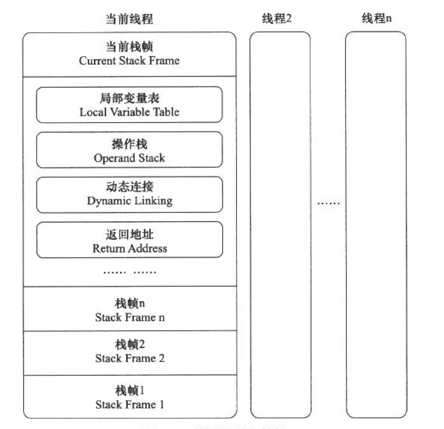
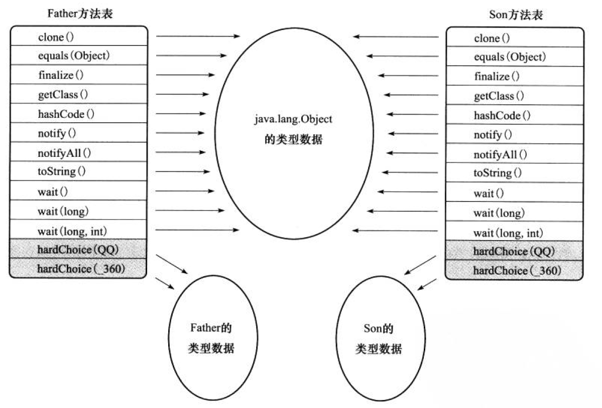
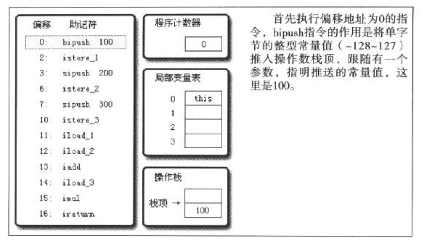
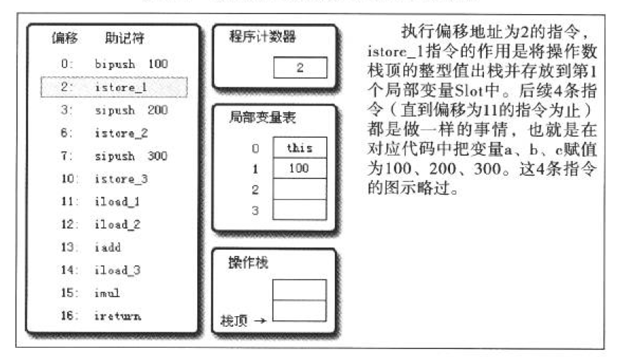
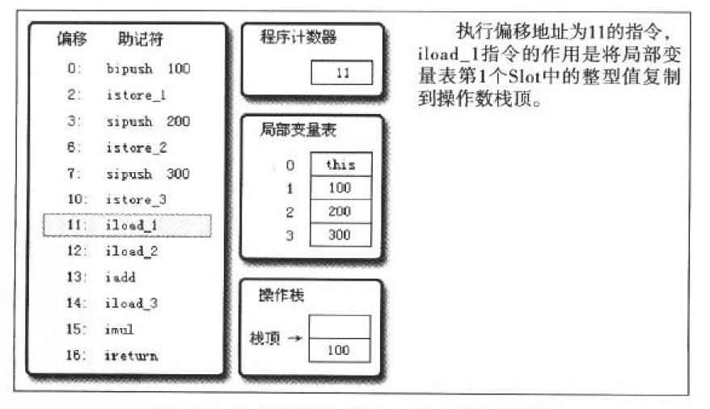
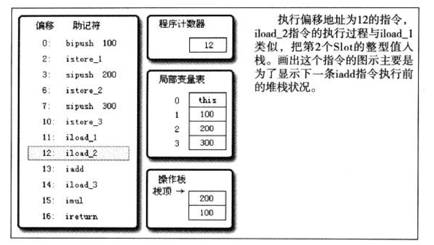
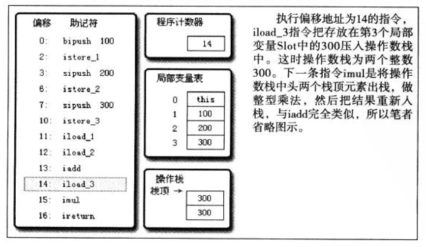
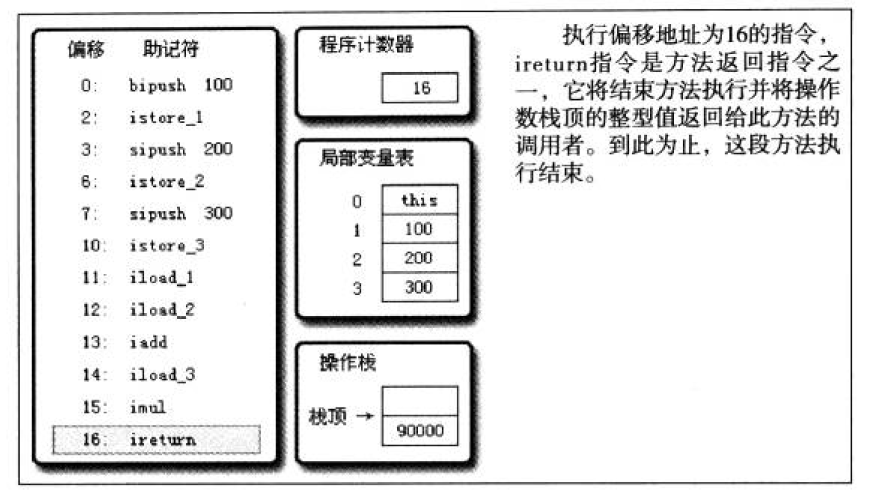

[TOC]

代码编译的结果从本机机器码转变为字节码，是存储格式发展的一小步，确实编程语言发展的一大步。

# 概述

**执行引擎是Java虚拟机最核心的组成部分之一。“虚拟机”是一个相对于“物理机”的概念，这两种机器都有代码执行能力，其区别是物理机的执行引擎是直接建立在处理器、硬件、指令集和操作系统层面上的，而虚拟机的执行引擎则是由自己实现的，因此可以自行制定指令集与执行引擎的结构体系，并且能够执行那些不被硬件直接支持的指令集格式。**

**在Java虚拟机规范中制定了虚拟机字节码执行引擎的概念模型，这个概念模型成为各种虚拟机执行引擎的统一外观（Facade）。**在不同的虚拟机实现里面，执行引擎在执行Java代码的时候**可能会有解释执行**（通过解释器执行）和**编译执行**（通过即时编译器产生本地代码执行）两种选择(有一些虚拟机（如Sun Classic VM）的内部只存在解释器，只能解释执行，而另外一些虚拟机（如BEA JRockit）的内部只存在即时编译器，只能编译执行)，也可能两者兼备，甚至还可能会包含几个不同级别的编译器执行引擎。但从外观上看起来，所有的Java虚拟机的执行引擎都是一致的：输入的是字节码文件，处理过程是字节码解析的等效过程，输出的是执行结果，本章将主要从概念模型的角度来讲解虚拟机的方法调用和字节码执行。

# 运行时栈帧结构

**栈帧（Stack Frame）是用于支持虚拟机进行方法调用和方法执行的数据结构，它是虚拟机运行时数据区中的虚拟机栈（Virtual Machine Stack）**(参见第二章第二小节)的栈元素。栈帧存储了方法的局部变量表、操作数栈、动态连接和方法返回地址等信息。每一个方法从调用开始至执行完成的过程，都对应着一个栈帧在虚拟机栈里面从入栈到出栈的过程。

**每一个栈帧都包括了局部变量表、操作数栈、动态连接、方法返回地址和一些额外的附加信息**。在编译程序代码的时候，栈帧中需要多大的局部变量表，多深的操作数栈都已经完全确定了，并且写入到方法表的Code属性之中(参见6.3.7节内容)，因此一个栈帧需要分配多少内存，不会受到程序运行期变量数据的影响，而仅仅取决于具体的虚拟机实现。

一个线程中的方法调用链可能会很长，很多方法都同时处于执行状态。对于执行引擎来说，**在活动线程中，只有位于栈顶的栈帧才是有效的，称为当前栈帧（Current Stack Frame），与这个栈帧相关联的方法称为当前方法（Current Method）**。执行引擎运行的所有字节码指令都只针对当前栈帧进行操作，在概念模型上，典型的栈帧结构如图8-1所示。
图　8-1　栈帧的概念结构



接下来详细讲解一下栈帧中的局部变量表、操作数栈、动态连接、方法返回地址等各个部分的作用和数据结构。

#### 局部变量表

局部变量表（Local Variable Table）是**一组变量值存储空间，用于存放方法参数和方法内部定义的局部变量**。在Java程序编译为Class文件时，就在方法的Code属性的max_locals数据项中确定了该方法所需要分配的局部变量表的最大容量。

局部变量表的**容量以变量槽（Variable Slot，下称Slot）为最小单位，虚拟机规范中并没有明确指明一个Slot应占用的内存空间大小，只是很有导向性地说到每个Slot都应该能存放一个boolean、byte、char、short、int、float、reference或returnAddress类型的数据**，这8种数据类型，都可以使用32位或更小的物理内存来存放，但这种描述与明确指出“每个Slot占用32位长度的内存空间”是有一些差别的，它允许Slot的长度可以随着处理器、操作系统或虚拟机的不同而发生变化。只要保证即使在64位虚拟机中使用了64位的物理内存空间去实现一个Slot，虚拟机仍要使用对齐和补白的手段让Slot在外观上看起来与32位虚拟机中的一致。

既然前面提到了Java虚拟机的数据类型，在此再简单介绍一下它们。一个Slot可以存放一个32位以内的数据类型，Java中占用32位以内的数据类型有boolean、byte、char、short、int、float、reference(Java虚拟机规范中没有明确规定reference类型的长度，它的长度与实际使用32还是64位虚拟机有关，如果是64位虚拟机，还与是否开启某些对象指针压缩的优化有关，这里暂且只取32位虚拟机的reference长度)和returnAddress 8种类型。**前面6种**不需要多加解释，可以按照Java语言中对应数据类型的概念去理解它们（仅是这样理解而已，Java语言与Java虚拟机中的基本数据类型是存在本质差别的），而**第7种reference类型**表示对一个对象实例的引用，虚拟机规范既没有说明它的长度，也没有明确指出这种引用应有怎样的结构。但一般来说，虚拟机实现至少都应当能通过这个引用做到两点，一是从此引用中直接或间接地查找到对象在Java堆中的数据存放的起始地址索引，二是此引用中直接或间接地查找到对象所属数据类型在方法区中的存储的类型信息，否则无法实现Java语言规范中定义的语法约束约束(并不是所有语言的对象引用都能满足这两点，例如C++语言，默认情况下（不开启RTTI支持的情况），就只能满足第一点，而不满足第二点。这也是为何C++中提供Java语言里很常见的反射的根本原因)。**第8种即returnAddress类型**目前已经很少见了，它是为字节码指令jsr、jsr_w和ret服务的，指向了一条字节码指令的地址，很古老的Java虚拟机曾经使用这几条指令来实现异常处理，现在已经由异常表代替。

对于**64位的数据类型，虚拟机会以高位对齐的方式为其分配两个连续的Slot空间**。Java语言中明确的（reference类型则可能是32位也可能是64位）64位的数据类型只有long和double两种。值得一提的是，这里把long和double数据类型分割存储的做法与“long和double的非原子性协定”中把一次long和double数据类型读写分割为两次32位读写的做法有些类似，读者阅读到Java内存模型时可以互相对比一下。不过，由于局部变量表建立在线程的堆栈上，是线程私有的数据，无论读写两个连续的Slot是否为原子操作，都不会引起数据安全问题(这是Java内存模型中定义的内容，关于原子操作与“long和double的非原子性协定”等问题，将在本书第12章中详细讲解)。

虚拟机**通过索引定位的方式使用局部变量表**，索引值的范围是从0开始至局部变量表最大的Slot数量。如果访问的是32位数据类型的变量，索引n就代表了使用第n个Slot，如果是64位数据类型的变量，则说明会同时使用n和n+1两个Slot。**对于两个相邻的共同存放一个64位数据的两个Slot，不允许采用任何方式单独访问其中的某一个**，Java虚拟机规范中明确要求了如果遇到进行这种操作的字节码序列，虚拟机应该在类加载的校验阶段抛出异常。

**在方法执行时，虚拟机是使用局部变量表完成参数值到参数变量列表的传递过程**的，如果执行的是**实例方法**（非static的方法），那局部变量表中**第0位索引的Slot默认是用于传递方法所属对象实例的引用**，在方法中可以通过关键字“this”来访问到这个隐含的参数。**其余参数则按照参数表顺序排列**，占用从1开始的局部变量Slot，**参数表分配完毕后，再根据方法体内部定义的变量顺序和作用域分配其余的Slot**。

为了**尽可能节省栈帧空间，局部变量表中的Slot是可以重用**的，方法体中定义的变量，其作用域并不一定会覆盖整个方法体，如果当前字节码PC计数器的值已经超出了某个变量的作用域，那这个变量对应的Slot就可以交给其他变量使用。不过，这样的设计**除了节省栈帧空间以外，还会伴随一些额外的副作用**，例如，在某些情况下，Slot的复用会直接影响到系统的垃圾收集行为，请看代码清单8-1～代码清单8-3的3个演示。

代码清单8-1　局部变量表Slot复用对垃圾收集的影响之一

```
package com.eussi.ch08_bytecode_execution_engine;

/**
 * 局部变量表Slot复用对垃圾收集的影响之一
 *
 * @author wangxueming
 */
public class ReuseFaults {
    public static void main(String[] args) {
        byte[]placeholder=new byte[64*1024*1024];
        System.gc();
    }
}
```

代码清单8-1中的代码很简单，即向内存填充了64MB的数据，然后通知虚拟机进行垃圾收集。我们在虚拟机运行参数中加上“-verbose:gc”来看看垃圾收集的过程，发现在System.gc()运行后并没有回收这64MB的内存，下面是运行的结果：

```
[GC 68208K->66288K(124416K), 0.0019604 secs]
[Full GC 66288K->66119K(124416K), 0.0149197 secs]
```

没有回收placeholder所占的内存能说得过去，因为在执行System.gc()时，变量placeholder还处于作用域之内，虚拟机自然不敢回收placeholder的内存。那我们把代码修改一下，变成代码清单8-2中的样子。

代码清单8-2　局部变量表Slot复用对垃圾收集的影响之二

```
package com.eussi.ch08_bytecode_execution_engine;

/**
 * 局部变量表Slot复用对垃圾收集的影响之二
 *
 * @author wangxueming
 */
public class ReuseFaults {
    public static void main(String[] args) {
        {
            byte[]placeholder=new byte[64*1024*1024];
        }
        System.gc();
    }
}
```

加入了花括号之后，placeholder的作用域被限制在花括号之内，从代码逻辑上讲，在执行System.gc()的时候，placeholder已经不可能再被访问了，但执行一下这段程序，会发现运行结果如下，还是有64MB的内存没有被回收，这又是为什么呢？

```
[GC 68208K->66200K(124416K), 0.0019030 secs]
[Full GC 66200K->66119K(124416K), 0.0174095 secs]
```

在解释为什么之前，我们先对这段代码进行第二次修改，在调用System.gc()之前加入一行“int a=0；”，变成代码清单8-3的样子。

代码清单8-3　局部变量表Slot复用对垃圾收集的影响之三

```
package com.eussi.ch08_bytecode_execution_engine;

/**
 * 局部变量表Slot复用对垃圾收集的影响之三
 *
 * @author wangxueming
 */
public class ReuseFaults {
    public static void main(String[] args) {
        {
            byte[]placeholder=new byte[64*1024*1024];
        }
        int a = 0;
        System.gc();
    }
}

```

这个修改看起来很莫名其妙，但运行一下程序，却发现这次内存真的被正确回收了。

```
[GC 68208K->66232K(124416K), 0.0033276 secs]
[Full GC 66232K->583K(124416K), 0.0701081 secs]
```

在代码清单8-1～代码清单8-3中，**placeholder能否被回收的根本原因是：局部变量表中的Slot是否还存有关于placeholder数组对象的引用。**第一次修改中，代码虽然已经离开了placeholder的作用域，但在此之后，没有任何对局部变量表的读写操作，placeholder原本所占用的Slot还没有被其他变量所复用，所以作为GC Roots一部分的局部变量表仍然保持着对它的关联。这种关联没有被及时打断，在**绝大部分情况下影响都很轻微。但如果遇到一个方法，其后面的代码有一些耗时很长的操作，而前面又定义了占用了大量内存、实际上已经不会再使用的变量，手动将其设置为null值**（用来代替那句int a=0，把变量对应的局部变量表Slot清空）便不见得是一个绝对无意义的操作，这种操作可以作为一种在极特殊情形（对象占用内存大、此方法的栈帧长时间不能被回收、方法调用次数达不到JIT的编译条件）下的“奇技”来使用。Java语言的一本非常著名的书籍《Practical Java》中把“不使用的对象应手动赋值为null”作为一条推荐的编码规则，但是并没有解释具体的原因，很长时间之内都有对这条规则感到疑惑。

虽然代码清单8-1～代码清单8-3的代码示例说明了**赋null值的操作在某些情况下确实是有用的，但是不应当对赋null值的操作有过多的依赖，更没有必要把它当做一个普遍的编码规则来推广**。原因有两点，从编码角度讲，以恰当的变量作用域来控制变量回收时间才是最优雅的解决方法，如代码清单8-3那样的场景并不多见。更关键的是，从执行角度讲，使用赋null值的操作来优化内存回收是建立在对字节码执行引擎概念模型的理解之上的，在第6章介绍完字节码后，专门增加了一个6.5节“公有设计、私有实现”来强调概念模型与实际执行过程是外部看起来等效，内部看上去则可以完全不同。在虚拟机使用解释器执行时，通常与概念模型还比较接近，但经过JIT编译器后，才是虚拟机执行代码的主要方式，赋null值的操作在经过JIT编译优化后就会被消除掉，这时候将变量设置为null就是没有意义的。字节码被编译为本地代码后，对GC Roots的枚举也与解释执行时期有巨大差别，以前面例子来看，代码清单8-2在经过JIT编译后，System.gc()执行时就可以正确地回收掉内
存，无须写成代码清单8-3的样子。

关于局部变量表，还有一点可能会对实际开发产生影响，就是**局部变量不像前面介绍的类变量那样存在“准备阶段”**。通过第7章的讲解，我们已经知道**类变量有两次赋初始值的过程**，一次在准备阶段，赋予系统初始值；另外一次在初始化阶段，赋予程序员定义的初始值。因此，即使在初始化阶段程序员没有为类变量赋值也没有关系，类变量仍然具有一个确定的初始值。但**局部变量就不一样，如果一个局部变量定义了但没有赋初始值是不能使用的，**不要认为Java中任何情况下都存在诸如整型变量默认为0，布尔型变量默认为false等这样的默认值。如代码清单8-4所示，这段代码其实并不能运行，还好编译器能在编译期间就检查到并提示这一点，即便编译能通过或者手动生成字节码的方式制造出下面代码的效果，字节码校验的时候也会被虚拟机发现而导致类加载失败。
代码清单8-4　未赋值的局部变量

```
public static void main(String[]args){
	int a;
	System.out.println(a);
}
```

#### 操作数栈

**操作数栈（Operand Stack）也常称为操作栈，它是一个后入先出（Last In First Out,LIFO）栈**。同局部变量表一样，操作数栈的最大深度也在编译的时候写入到Code属性的**max_stacks**数据项中。操作数栈的每一个元素可以是任意的Java数据类型，包括long和double。32位数据类型所占的栈容量为1，64位数据类型所占的栈容量为2。在**方法执行的任何时候，操作数栈的深度都不会超过在max_stacks数据项中设定的最大值**。

当**一个方法刚刚开始执行的时候，这个方法的操作数栈是空的，在方法的执行过程中，会有各种字节码指令往操作数栈中写入和提取内容，也就是出栈/入栈操作**。例如，在做算术运算的时候是通过操作数栈来进行的，又或者在调用其他方法的时候是通过操作数栈来进行参数传递的。

举个例子，整数加法的字节码指令iadd在运行的时候操作数栈中最接近栈顶的两个元素已经存入了两个int型的数值，当执行这个指令时，会将这两个int值出栈并相加，然后将相加的结果入栈。

**操作数栈中元素的数据类型必须与字节码指令的序列严格匹配，在编译程序代码的时候，编译器要严格保证这一点，在类校验阶段的数据流分析中还要再次验证这一点。**再以上面的iadd指令为例，这个指令用于整型数加法，它在执行时，最接近栈顶的两个元素的数据类型必须为int型，不能出现一个long和一个float使用iadd命令相加的情况。

另外，在概念模型中，两个栈帧作为虚拟机栈的元素，是完全相互独立的。但在大多虚拟机的实现里都会做一些优化处理，令两个栈帧出现一部分重叠。让下面栈帧的部分操作数栈与上面栈帧的部分局部变量表重叠在一起，这样在进行方法调用时就可以共用一部分数据，无须进行额外的参数复制传递，重叠的过程如图8-2所示。
图　8-2　两个栈帧之间的数据共享


Java虚拟机的解释执行引擎称为**“基于栈的执行引擎”，其中所指的“栈”就是操作数栈**。本章稍后会对基于栈的代码过程进行更详细的讲解。

#### 动态连接

**每个栈帧都包含一个指向运行时常量池(参考第二章)中该栈帧所属方法的引用**，持有这个引用是为了支持方法调用过程中的动态连接（Dynamic Linking）。通过第6章的讲解，我们知道Class文件的常量池中存有大量的符号引用，字节码中的方法调用指令就以常量池中指向方法的符号引用作为参数。这些符号引用一部分会在类加载阶段或者第一次使用的时候就转化为直接引用，这种转化称为静态解析。另外一部分将在每一次运行期间转化为直接引用，这部分称为动态连接。关于这两个转化过程的详细信息，将在下一节中详细讲解。

#### 方法返回地址

当**一个方法开始执行后，只有两种方式可以退出这个方法**。第一种方式是执行引擎遇到任意一个方法返回的字节码指令，这时候可能会有返回值传递给上层的方法调用者（调用当前方法的方法称为调用者），是否有返回值和返回值的类型将根据遇到何种方法返回指令来决定，这种退出方法的方式称为正常完成出口（Normal Method Invocation Completion）。

另外一种退出方式是，在方法执行过程中遇到了异常，并且这个异常没有在方法体内得到处理，无论是Java虚拟机内部产生的异常，还是代码中使用athrow字节码指令产生的异常，只要在本方法的异常表中没有搜索到匹配的异常处理器，就会导致方法退出，这种退出方法的方式称为异常完成出口（Abrupt Method Invocation Completion）。**一个方法使用异常完成出口的方式退出，是不会给它的上层调用者产生任何返回值的**。

**无论采用何种退出方式，在方法退出之后，都需要返回到方法被调用的位置，程序才能继续执行，方法返回时可能需要在栈帧中保存一些信息，用来帮助恢复它的上层方法的执行状态**。一般来说，方法正常退出时，调用者的PC计数器的值可以作为返回地址，栈帧中很可能会保存这个计数器值。而方法异常退出时，返回地址是要通过异常处理器表来确定的，栈帧中一般不会保存这部分信息。

**方法退出的过程实际上就等同于把当前栈帧出栈**，因此退出时可能执行的操作有：恢复上层方法的局部变量表和操作数栈，把返回值（如果有的话）压入调用者栈帧的操作数栈中，调整PC计数器的值以指向方法调用指令后面的一条指令等。

#### 附加信息

虚拟机**规范允许具体的虚拟机实现增加一些规范里没有描述的信息到栈帧之中**，例如与调试相关的信息，这部分信息完全取决于具体的虚拟机实现，这里不再详述。**在实际开发中，一般会把动态连接、方法返回地址与其他附加信息全部归为一类，称为栈帧信息**。

# 方法调用

方法调用**并不等同于方法执行，方法调用阶段唯一的任务就是确定被调用方法的版本（即调用哪一个方法），暂时还不涉及方法内部的具体运行过程**。在程序运行时，进行方法调用是最普遍、最频繁的操作，但前面已经讲过，Class文件的编译过程中**不包含传统编译中的连接步骤**，一切方法调用在Class文件里面存储的都只是符号引用，而不是方法在实际运行时内存布局中的入口地址（相当于之前说的直接引用）。这个特性给Java带来了更强大的动
态扩展能力，但也使得Java方法调用过程变得相对复杂起来，需要在类加载期间，甚至到运行期间才能确定目标方法的直接引用。

#### 解析

继续前面关于方法调用的话题，**所有方法调用中的目标方法在Class文件里面都是一个常量池中的符号引用，在类加载的解析阶段，会将其中的一部分符号引用转化为直接引用，这种解析能成立的前提是：方法在程序真正运行之前就有一个可确定的调用版本，并且这个方法的调用版本在运行期是不可改变的。换句话说，调用目标在程序代码写好、编译器进行编译时就必须确定下来。这类方法的调用称为解析（Resolution**）。

在Java语言中符合**“编译期可知，运行期不可变”这个要求的方法，主要包括静态方法和私有方法**两大类，前者与类型直接关联，后者在外部不可被访问，这两种方法各自的特点决定了它们都不可能通过继承或别的方式重写其他版本，因此它们都适合在类加载阶段进行解析。

与之相对应的是，在Java虚拟机里面提供了5条方法调用字节码指令，分别如下。

- invokestatic：调用静态方法。
- invokespecial：调用实例构造器＜init＞方法、私有方法和父类方法。
- invokevirtual：调用所有的虚方法。
- invokeinterface：调用接口方法，会在运行时再确定一个实现此接口的对象。
- invokedynamic：先在运行时动态解析出调用点限定符所引用的方法，然后再执行该方
  法，在此之前的4条调用指令，分派逻辑是固化在Java虚拟机内部的，而invokedynamic指令
  的分派逻辑是由用户所设定的引导方法决定的。

只要能被invokestatic和invokespecial指令调用的方法，都可以在解析阶段中确定唯一的调用版本，符合这个条件的有静态方法、私有方法、实例构造器、父类方法4类，它们**在类加载的时候就会把符号引用解析为该方法的直接引用**。这些方法可以称为**非虚方法**，与之相反，**其他方法称为虚方法（除去final方法，后文会提到）**。代码清单8-5演示了一个最常见的解析调用的例子，此样例中，静态方法sayHello（）只可能属于类型StaticResolution，没有任何手段可以覆盖或隐藏这个方法。

代码清单8-5　方法静态解析演示

```
package com.eussi.ch08_bytecode_execution_engine;

/**
 * 方法静态解析演示
 * @author wangxueming
 */
public class StaticResolution {
    public static void sayHello() {
        System.out.println("hello world");
    }

    public static void main(String[] args) {
        StaticResolution.sayHello();
    }
}
```

使用javap命令查看这段程序的字节码，会发现的确是通过invokestatic命令来调用sayHello()方法的。

```
  public static void sayHello();
    flags: ACC_PUBLIC, ACC_STATIC
    Code:
      stack=2, locals=0, args_size=0
         0: getstatic     #2                  // Field java/lang/System.out:Ljava/io/PrintStream;
         3: ldc           #3                  // String hello world
         5: invokevirtual #4                  // Method java/io/PrintStream.println:(Ljava/lang/String;)V
         8: return
      LineNumberTable:
        line 9: 0
        line 10: 8
```

Java中的非虚方法除了使用invokestatic、invokespecial调用的方法之外还有一种，就是**被final修饰的方法**。虽然final方法是使用invokevirtual指令来调用的，但是由于它无法被覆盖，没有其他版本，所以也无须对方法接收者进行多态选择，又或者说多态选择的结果肯定是唯一的。**在Java语言规范中明确说明了final方法是一种非虚方法。**

**解析调用一定是个静态的过程，在编译期间就完全确定，在类装载的解析阶段就会把涉及的符号引用全部转变为可确定的直接引用，不会延迟到运行期再去完成。而分派（Dispatch）调用则可能是静态的也可能是动态的，根据分派依据的宗量数(后文中都会有所解释)可分为单分派和多分派**。这两类分派方式的两两组合就构成了静态单分派、静态多分派、动态单分派、动态多分派4种分派组合情况，下面我们再看看虚拟机中的方法分派是如何进行的。

#### 分派

众所周知，Java是一门面向对象的程序语言，因为Java具备面向对象的3个基本特征：继承、封装和多态。本节讲解的分派调用过程将会揭示多态性特征的一些最基本的体现，如“重载”和“重写”在Java虚拟机之中是如何实现的，这里的实现当然不是语法上该如何写，我们关心的依然是虚拟机如何确定正确的目标方法。

##### 静态分派

在开始讲解静态分派(严格来说，Dispatch这个词一般不用在静态环境之中，英文技术文档的称呼是“Method
Overload Resolution”，但国内的各种资料都普遍将这种行为翻译成“静态分派”，特此说明)前，准备了一段经常出现在面试题中的程序代码，不妨先看一遍，想一下程序的输出结果是什么。后面我们的话题将围绕这个类的方法来重载（Overload）代码，以分析虚拟机和编译器确定方法版本的过程。方法静态分派如代码清单8-6所示。

代码清单8-6　方法静态分派演示

```
package com.eussi.ch08_bytecode_execution_engine;

/**
 * 方法静态分派演示
 *
 * @author wangxueming
 */
public class StaticDispatch {
    static abstract class Human {
    }

    static class Man extends Human {
    }

    static class Woman extends Human {
    }

    public void sayHello(Human guy) {
        System.out.println("hello,guy！");
    }

    public void sayHello(Man guy) {
        System.out.println("hello,gentleman！");
    }

    public void sayHello(Woman guy) {
        System.out.println("hello,lady！");
    }

    public static void main(String[] args) {
        Human man = new Man();
        Human woman = new Woman();
        StaticDispatch sr = new StaticDispatch();
        sr.sayHello(man);
        sr.sayHello(woman);
    }
}
```

运行结果：

```
hello,guy！
hello,guy！
```

代码清单8-6中的代码实际上是在考验阅读者对重载的理解程度，相信对Java编程稍有经验的程序员看完程序后都能得出正确的运行结果，但为什么会选择执行参数类型为Human的重载呢？在解决这个问题之前，我们先按如下代码定义两个重要的概念。

```
Human man = new Man();
```

我们**把上面代码中的“Human”称为变量的静态类型（Static Type），或者叫做的外观类型（Apparent Type），后面的“Man”则称为变量的实际类型（Actual Type）**，静态类型和实际类型在程序中都可以发生一些变化，区别是**静态类型的变化仅仅在使用时发生，变量本身的静态类型不会被改变**，并且最终的静态类型是在编译期可知的；而**实际类型变化的结果在运行期才可确定，编译器在编译程序的时候并不知道一个对象的实际类型是什么**。例如下面的代码：

```
//实际类型变化
Human man=new Man();
man=new Woman();
//静态类型变化
sr.sayHello((Man)man);
sr.sayHello((Woman)woman);
```

解释了这两个概念，再回到代码清单8-6的样例代码中。main()里面的两次sayHello()方法调用，在方法接收者已经确定是对象“sr”的前提下，使用哪个重载版本，就完全取决于传入参数的数量和数据类型。代码中刻意地定义了两个静态类型相同但实际类型不同的变量，但虚拟机（准确地说是编译器）在重载时是**通过参数的静态类型而不是实际类型作为判定依据的**。并且静态类型是编译期可知的，**因此，在编译阶段，Javac编译器会根据参数的静态类型决定使用哪个重载版本，所以选择了sayHello（Human）作为调用目标，并把这个方法的符号引用写到main（）方法里的两条invokevirtual指令的参数中**。

**所有依赖静态类型来定位方法执行版本的分派动作称为静态分派。静态分派的典型应用是方法重载。静态分派发生在编译阶段，因此确定静态分派的动作实际上不是由虚拟机来执行的。**另外，编译器虽然能确定出方法的重载版本，但在很多情况下这个重载版本并不是“唯一的”，往往只能确定一个“更加合适的”版本。这种模糊的结论在由0和1构成的计算机世界中算是比较“稀罕”的事情，产生这种模糊结论的主要原因是字面量不需要定义，所以字面量没有显式的静态类型，它的静态类型只能通过语言上的规则去理解和推断。代码清单8-7演示了何为“更加合适的”版本。

代码清单8-7　重载方法匹配优先级

```
package com.eussi.ch08_bytecode_execution_engine;

import java.io.Serializable;

/**
 * 重载方法匹配优先级
 *
 * @author wangxueming
 */
public class Overload {
    public static void sayHello(Object arg) {
        System.out.println("hello Object");
    }

    public static void sayHello(int arg) {
        System.out.println("hello int");
    }

    public static void sayHello(long arg) {
        System.out.println("hello long");
    }

    public static void sayHello(Character arg) {
        System.out.println("hello Character");
    }

    public static void sayHello(char arg) {
        System.out.println("hello char");
    }

    public static void sayHello(char... arg) {
        System.out.println("hello char...");
    }

    public static void sayHello(Serializable arg) {
        System.out.println("hello Serializable");
    }

    public static void main(String[] args) {
        sayHello('a');
    }
}
```

上面的代码运行后会输出：

```
hello char
```

这很好理解，'a'是一个char类型的数据，自然会寻找参数类型为char的重载方法，如果注释掉sayHello（char arg）方法，那输出会变为：

```
hello int
```

这时发生了一次自动类型转换，'a'除了可以代表一个字符串，还可以代表数字97（字符'a'的Unicode数值为十进制数字97），因此参数类型为int的重载也是合适的。我们继续注释掉sayHello（int arg）方法，那输出会变为：

```
hello long
```

这时发生了两次自动类型转换，'a'转型为整数97之后，进一步转型为长整数97L，匹配了参数类型为long的重载。在代码中没有写其他的类型如float、double等的重载，不过**实际上自动转型还能继续发生多次，按照char-＞int-＞long-＞float-＞double的顺序转型进行匹配**。但不会匹配到byte和short类型的重载，因为char到byte或short的转型是不安全的。我们继续注释掉sayHello（long arg）方法，那输出会变为：

```
hello Character
```

这时发生了一次自动装箱，'a'被包装为它的封装类型java.lang.Character，所以匹配到了参数类型为Character的重载，继续注释掉sayHello（Character arg）方法，那输出会变为：

```
hello Serializable
```

这个输出可能会让人感觉摸不着头脑，一个字符或数字与序列化有什么关系？出现hello Serializable，是因为java.lang.Serializable是java.lang.Character类实现的一个接口，当**自动装箱之后发现还是找不到装箱类，但是找到了装箱类实现了的接口类型，所以紧接着又发生一次自动转型**。char可以转型成int，但是Character是绝对不会转型为Integer的，它只能安全地转型为它实现的接口或父类。Character还实现了另外一个接口java.lang.Comparable＜Character＞，**如果同时出现两个参数分别为Serializable和Comparable\<Character>的重载方法，那它们在此时的优先级是一样的。编译器无法确定要自动转型为哪种类型，会提示类型模糊，拒**
**绝编译**。程序必须在调用时显式地指定字面量的静态类型，如：sayHello((Comparable\<Character>)'a')，才能编译通过。下面继续注释掉sayHello(Serializable arg)方法，输出会变为：

```
hello Object
```

这时是**char装箱后转型为父类了，如果有多个父类，那将在继承关系中从下往上开始搜索**，越接近上层的优先级越低。即使方法调用传入的参数值为null时，这个规则仍然适用。

我们把sayHello（Object arg）也注释掉，输出将会变为：

```
hello char...
```

7个重载方法已经被注释得只剩一个了，**可见变长参数的重载优先级是最低的**，这时候字符'a'被当做了一个数组元素。这里使用的是char类型的变长参数，在验证时还可以选择int类型、Character类型、Object类型等的变长参数重载来把上面的过程重新演示一遍。但要注意的是，**有一些在单个参数中能成立的自动转型，如char转型为int，在变长参数中是不成立的**(重载中选择最合适方法的过程，可参见Java语言规范的§15.12.2.5 Choosing the Most
Specific Method章节)。

代码清单8-7演示了编译期间选择静态分派目标的过程，这个过程也是Java语言实现方法重载的本质。演示所用的这段程序属于很极端的例子，除了用做面试题为难求职者以外，在实际工作中几乎不可能有实际用途。拿来做演示仅仅是用于讲解重载时目标方法选择的过程，大部分情况下进行这样极端的重载都可算是真正的“关于茴香豆的茴有几种写法的研究”。无论对重载的认识有多么深刻，一个合格的程序员都不应该在实际应用中写出如此极端的重载代码。

另外还有一点可能比较容易混淆：**讲述的解析与分派这两者之间的关系并不是二选一的排他关系，它们是在不同层次上去筛选、确定目标方法的过程**。例如，前面说过，静态方法会在类加载期就进行解析，而静态方法显然也是可以拥有重载版本的，选择重载版本的过程也是通过静态分派完成的。

##### 动态分派

了解了静态分派，我们接下来看一下动态分派的过程，它和多态性的另外一个重要体现(有一种观点认为：因为重载是静态的，重写是动态的，所以只有重写算是多态性的体现，重载不算多态。笔者认为这种争论没有意义，概念仅仅是说明问题的一种工具而已)——重写（Override）有着很密切的关联。我们还是用前面的Man和Woman一起sayHello的例子来讲解动态分派，请看代码清单8-8中所示的代码。
代码清单8-8　方法动态分派演示

```
package com.eussi.ch08_bytecode_execution_engine;

/**
 * 方法动态分派演示
 *
 * @author wangxueming
 */
public class DynamicDispatch {
    static abstract class Human {
        protected abstract void sayHello();
    }

    static class Man extends Human {
        @Override
        protected void sayHello() {
            System.out.println("man say hello");
        }
    }

    static class Woman extends Human {
        @Override
        protected void sayHello() {
            System.out.println("woman say hello");
        }
    }

    public static void main(String[] args) {
        Human man = new Man();
        Human woman = new Woman();
        man.sayHello();
        woman.sayHello();
        man = new Woman();
        man.sayHello();
    }
}
```

运行结果：

```
man say hello
woman say hello
woman say hello
```

这个运行结果相信不会出乎任何人的意料，对于习惯了面向对象思维的Java程序员会觉得这是完全理所当然的。现在的问题还是和前面的一样，虚拟机是如何知道要调用哪个方法的？

显然这里不可能再根据静态类型来决定，因为静态类型同样都是Human的两个变量man和woman在调用sayHello()方法时执行了不同的行为，并且变量man在两次调用中执行了不同的方法。**导致这个现象的原因很明显，是这两个变量的实际类型不同**，Java虚拟机是如何根据实际类型来分派方法执行版本的呢？我们使用javap命令输出这段代码的字节码，尝试从中寻找答案，输出结果如代码清单8-9所示。

代码清单8-9　main（）方法的字节码

```
 public static void main(java.lang.String[]);
    flags: ACC_PUBLIC, ACC_STATIC
    Code:
      stack=2, locals=3, args_size=1
         0: new           #2                  // class com/eussi/ch08_bytecode_execution_engine/DynamicDispatch$Man
         3: dup
         4: invokespecial #3                  // Method com/eussi/ch08_bytecode_execution_engine/DynamicDispatch$Man."<init>":()V
         7: astore_1
         8: new           #4                  // class com/eussi/ch08_bytecode_execution_engine/DynamicDispatch$Woman
        11: dup
        12: invokespecial #5                  // Method com/eussi/ch08_bytecode_execution_engine/DynamicDispatch$Woman."<init>":()V
        15: astore_2
        16: aload_1
        17: invokevirtual #6                  // Method com/eussi/ch08_bytecode_execution_engine/DynamicDispatch$Human.sayHello:()V
        20: aload_2
        21: invokevirtual #6                  // Method com/eussi/ch08_bytecode_execution_engine/DynamicDispatch$Human.sayHello:()V
        24: new           #4                  // class com/eussi/ch08_bytecode_execution_engine/DynamicDispatch$Woman
        27: dup
        28: invokespecial #5                  // Method com/eussi/ch08_bytecode_execution_engine/DynamicDispatch$Woman."<init>":()V
        31: astore_1
        32: aload_1
        33: invokevirtual #6                  // Method com/eussi/ch08_bytecode_execution_engine/DynamicDispatch$Human.sayHello:()V
        36: return
```

0～15行的字节码是准备动作，作用是建立man和woman的内存空间、调用Man和Woman类型的实例构造器，将这两个实例的引用存放在第1、2个局部变量表Slot之中，这个动作也
就对应了代码中的这两句：

```
Human man = new Man();
Human woman = new Woman();
```

接下来的16～21句是关键部分，16、20两句分别把刚刚创建的两个对象的引用压到栈顶，这两个对象是将要执行的sayHello（）方法的所有者，称为接收者（Receiver）；17和21句是方法调用指令，这两条调用指令单从字节码角度来看，无论是指令（都是invokevirtual）还是参数（都是常量池中第6项的常量，**注释显示了这个常量是**
**Human.sayHello（）的符号引用）完全一样的，但是这两句指令最终执行的目标方法并不相同**。原因就需要从invokevirtual指令的多态查找过程开始说起，invokevirtual指令的运行时解析过程大致分为以下几个步骤：

1. 找到操作数栈顶的第一个元素所指向的对象的实际类型，记作C。
2. 如果在类型C中找到与常量中的描述符和简单名称都相符的方法，则进行访问权限校验，如果通过则返回这个方法的直接引用，查找过程结束；如果不通过，则返回java.lang.IllegalAccessError异常。
3. 否则，按照继承关系从下往上依次对C的各个父类进行第2步的搜索和验证过程。
4. 如果始终没有找到合适的方法，则抛出java.lang.AbstractMethodError异常。

**由于invokevirtual指令执行的第一步就是在运行期确定接收者的实际类型，所以两次调用中的invokevirtual指令把常量池中的类方法符号引用解析到了不同的直接引用上，这个过程就是Java语言中方法重写的本质**。我们把这种在运行期根据实际类型确定方法执行版本的分派过程称为动态分派。

##### 单分派与多分派

方法的接收者与方法的参数统称为方法的宗量，这个定义最早应该来源于《Java与模式》一书。根据分派基于多少种宗量，可以将分派划分为单分派和多分派两种。**单分派是根据一个宗量对目标方法进行选择，多分派则是根据多于一个宗量对目标方法进行选择**。

单分派和多分派的定义读起来拗口，从字面上看也比较抽象，不过对照着实例看就不难理解了。代码清单8-10中列举了一个Father和Son一起来做出“一个艰难的决定”的例子。

代码清单8-10　单分派和多分派

```
package com.eussi.ch08_bytecode_execution_engine;

/**
 * 单分派、多分派演示
 *
 * @author wangxueming
 */
public class Dispatch {
    static class QQ {
    }

    static class _360 {
    }

    public static class Father {
        public void hardChoice(QQ arg) {
            System.out.println("father choose qq");
        }

        public void hardChoice(_360 arg) {
            System.out.println("father choose 360");
        }
    }

    public static class Son extends Father {
        public void hardChoice(QQ arg) {
            System.out.println("son choose qq");
        }

        public void hardChoice(_360 arg) {
            System.out.println("son choose 360");
        }
    }

    public static void main(String[] args) {
        Father father = new Father();
        Father son = new Son();
        father.hardChoice(new _360());
        son.hardChoice(new QQ());
    }
}
```

运行结果：

```
father choose 360
son choose qq
```

在main函数中调用了两次hardChoice（）方法，这两次hardChoice（）方法的选择结果在程序输出中已经显示得很清楚了。

我们来看看编译阶段编译器的选择过程，也就是静态分派的过程。这时选择目标方法的依据有两点：一是静态类型是Father还是Son，二是方法参数是QQ还是360。这次选择结果的最终产物是产生了两条invokevirtual指令，两条指令的参数分别为常量池中指向Father.hardChoice（360）及Father.hardChoice（QQ）方法的符号引用。**因为是根据两个宗量进行选择，所以Java语言的静态分派属于多分派类型**。

再看看运行阶段虚拟机的选择，也就是动态分派的过程。在执行“son.hardChoice（new QQ（））”这句代码时，更准确地说，是在执行这句代码所对应的invokevirtual指令时，由于编译期已经决定目标方法的签名必须为hardChoice（QQ），虚拟机此时不会关心传递过来的参数“QQ”到底是“腾讯QQ”还是“奇瑞QQ”，因为这时参数的静态类型、实际类型都对方法的选择不会构成任何影响，唯一可以影响虚拟机选择的因素只有此方法的接受者的实际类型是Father还是Son。**因为只有一个宗量作为选择依据，所以Java语言的动态分派属于单分派类型**。

根据上述论证的结果，我们可以总结一句：**今天（直至还未发布的Java 1.8）的Java语言是一门静态多分派、动态单分派的语言。强调“今天的Java语言”是因为这个结论未必会恒久不变**，C#在3.0及之前的版本与Java一样是动态单分派语言，但在C#4.0中引入了dynamic类型后，就可以很方便地实现动态多分派。

按照目前Java语言的发展趋势，它并没有直接变为动态语言的迹象，而是通过内置动态语言（如JavaScript）执行引擎的方式来满足动态性的需求。但是Java虚拟机层面上则不是如此，在JDK 1.7中实现的JSR-292(Supporting Dynamically Typed Languages on the Java Platform , Java平台的动态语言支持)里面就已经开始提供对动态语言的支持了，JDK 1.7中新增的invokedynamic指令也成为了最复杂的一条方法调用的字节码指令，稍后将专门讲解这个JDK 1.7的新特性。

##### 虚拟机动态分派的实现

前面介绍的分派过程，作为对虚拟机概念模型的解析基本上已经足够了，它已经解决了虚拟机在分派中“会做什么”这个问题。但是虚拟机“具体是如何做到的”，可能各种虚拟机的实现都会有些差别。

由于动态分派是非常频繁的动作，而且动态分派的方法版本选择过程需要运行时在类的方法元数据中搜索合适的目标方法，因此在虚拟机的实际实现中**基于性能的考虑**，大部分实现都不会真正地进行如此频繁的搜索。面对这种情况，**最常用的“稳定优化”手段就是为类在方法区中建立一个虚方法表（Vritual Method Table，也称为vtable，与此对应的，在invokeinterface执行时也会用到接口方法表——Inteface Method Table，简称itable）**，使用虚方法表索引来代替元数据查找以提高性能。我们先看看代码清单8-10所对应的虚方法表结构示例，如图8-3所示。

图　8-3　方法表结构



**虚方法表中存放着各个方法的实际入口地址。如果某个方法在子类中没有被重写，那子类的虚方法表里面的地址入口和父类相同方法的地址入口是一致的，都指向父类的实现入口。如果子类中重写了这个方法，子类方法表中的地址将会替换为指向子类实现版本的入口地址**。图8-3中，Son重写了来自Father的全部方法，因此Son的方法表没有指向Father类型数据的箭头。但是Son和Father都没有重写来自Object的方法，所以它们的方法表中所有从
Object继承来的方法都指向了Object的数据类型。

**为了程序实现上的方便，具有相同签名的方法，在父类、子类的虚方法表中都应当具有一样的索引序号**，这样当类型变换时，仅需要变更查找的方法表，就可以从不同的虚方法表中按索引转换出所需的入口地址。

**方法表一般在类加载的连接阶段进行初始化，准备了类的变量初始值后，虚拟机会把该类的方法表也初始化完毕。**

上文中说方法表是分派调用的“稳定优化”手段，虚拟机除了使用方法表之外，在条件允许的情况下，还会使用内联缓存（Inline Cache）和基于“类型继承关系分析”（Class Hierarchy Analysis,CHA）技术的守护内联（Guarded Inlining）两种非稳定的“激进优化”手段来获得更高的性能，关于这两种优化技术的原理和运作过程，可以参考本书第11章中的相关内容。

#### 动态类型语言支持

Java虚拟机的字节码指令集的数量从Sun公司的第一款Java虚拟机问世至JDK 7来临之前的十余年时间里，一直没有发生任何变化。随着JDK 7的发布，字节码指令集终于迎来了第一位新成员——invokedynamic指令。这条新增加的指令是JDK 7实现“动态类型语言”（Dynamically Typed Language）支持而进行的改进之一，也是为JDK 8可以顺利实现Lambda表达式做技术准备。在本节中，我们将详细讲解JDK 7这项新特性出现的前因后果和它的深远意义。

##### 动态类型语言

在介绍Java虚拟机的动态类型语言支持之前，我们要先弄明白动态类型语言是什么？它与Java语言、Java虚拟机有什么关系？了解JDK 1.7提供动态类型语言支持的技术背景，对理解这个语言特性是很有必要的。

什么是动态类型语言(注意，动态类型语言与动态语言、弱类型语言并不是一个概念，需要区别对待)？**动态类型语言的关键特征是它的类型检查的主体过程是在运行期而不是编译期**，满足这个特征的语言有很多，常用的包括：APL、Clojure、Erlang、Groovy、JavaScript、Jython、Lisp、Lua、PHP、Prolog、Python、Ruby、Smalltalk和Tcl等。相对的，在编译期就进行类型检查过程的语言（如C++和Java等）就是最常用的静态类型语言。

觉得上面定义过于概念化？那我们不妨通过两个例子以最浅显的方式来说明什么是“在编译期/运行期进行”和什么是“类型检查”。首先看下面这段简单的Java代码，它是否能正常编译和运行？

```
public static void main(String[] args){
	int[][][] array=new int[1][0][-1];
}
```

这段代码能够正常编译，但运行的时候会报NegativeArraySizeException异常。在Java虚拟机规范中明确规定了NegativeArraySizeException是一个**运行时异常**，通俗一点来说，运行时异常就是只要代码不运行到这一行就不会有问题。与运行时异常相对应的是**连接时异常**，例如很常见的NoClassDefFoundError便属于连接时异常，即使会导致连接时异常的代码放在一条无法执行到的分支路径上，类加载时（**Java的连接过程不在编译阶段，而在类加载阶段**）也照样会抛出异常。

不过，在C语言中，含义相同的代码会在编译期报错：

```
int main(void){
	int i[1][0][-1];//GCC拒绝编译，报“size of array is negative”
	return 0;
}
```

由此看来，一门语言的哪一种检查行为要在运行期进行，哪一种检查要在编译期进行并没有必然的因果逻辑关系，关键是语言规范中人为规定的。再举一个例子来解释“类型检查”，例如下面这一句非常简单的代码：\

```
obj.println("hello world");
```

虽然每个人都能看懂这行代码要做什么，但对于计算机来说，这一行代码“没头没尾”是无法执行的，它需要一个具体的上下文才有讨论的意义。

**现在假设这行代码是在Java语言中，并且变量obj的静态类型为java.io.PrintStream，那变量obj的实际类型就必须是PrintStream的子类（实现了PrintStream接口的类）才是合法的。否则，哪怕obj属于一个确实有用println（String）方法，但与PrintStream接口没有继承关系，代码依然不可能运行——因为类型检查不合法。但是相同的代码在ECMAScript（JavaScript）中情况则不一样，无论obj具体是何种类型，只要这种类型的定义中确实包含有println（String）方法，那方法调用便可成功。**

这种差别产生的原因是Java语言在编译期间已将println（String）方法完整的符号引用（本例中为一个CONSTANT_InterfaceMethodref_info常量）生成出来，作为方法调用指令的参数存储到Class文件中，例如下面这段代码：

```
invokevirtual#4; //Method java/io/PrintStream.println：（Ljava/lang/String；）V
```

这个符号引用包含了此方法定义在哪个具体类型之中、方法的名字以及参数顺序、参数类型和方法返回值等信息，通过这个符号引用，虚拟机可以翻译出这个方法的直接引用。而在ECMAScript等动态类型语言中，变量obj本身是没有类型的，变量obj的值才具有类型，编译时最多只能确定方法名称、参数、返回值这些信息，而不会去确定方法所在的具体类型（即方法接收者不固定）。**“变量无类型而变量值才有类型”这个特点也是动态类型语言的一**
**个重要特征。**

了解了动态和静态类型语言的区别后，也许下一个问题就是**动态、静态类型语言两者谁更好，或者谁更加先进？这种比较不会有确切答案，因为它们都有自己的优点，选择哪种语言是需要经过权衡的**。静态类型语言在编译期确定类型，最显著的好处是编译器可以提供严谨的类型检查，这样与类型相关的问题能在编码的时候就及时发现，利于稳定性及代码达到更大规模。而动态类型语言在运行期确定类型，这可以为开发人员提供更大的灵活
性，某些在静态类型语言中需用大量“臃肿”代码来实现的功能，由动态类型语言来实现可能会更加清晰和简洁，清晰和简洁通常也就意味着开发效率的提升。

##### JDK 1.7与动态类型

回到本节的主题，来看看Java语言、虚拟机与动态类型语言之间有什么关系。Java虚拟机毫无疑问是Java语言的运行平台，但它的使命并不仅限于此，早在1997年出版的《Java虚拟机规范》中就规划了这样一个愿景：“在未来，我们会对Java虚拟机进行适当的扩展，以便更好地支持其他语言运行于Java虚拟机之上”。而目前确实已经有许多动态类型语言运行于Java虚拟机之上了，如Clojure、Groovy、Jython和JRuby等，能够在同一个虚拟机上可以达
到静态类型语言的严谨性与动态类型语言的灵活性，这是一件很美妙的事情。

但遗憾的是，Java虚拟机层面对动态类型语言的支持一直都有所欠缺，主要表现在方法调用方面：JDK 1.7以前的字节码指令集中，4条方法调用指令（invokevirtual、invokespecial、invokestatic、invokeinterface）的**第一个参数都是被调用的方法的符号引用**（CONSTANT_Methodref_info或者CONSTANT_InterfaceMethodref_info常量），前面已经提到过，方法的符号引用在编译时产生，而动态类型语言只有在运行期才能确定接收者类型。这
样，在Java虚拟机上实现的动态类型语言就不得不使用其他方式（如编译时留个占位符类型，运行时动态生成字节码实现具体类型到占位符类型的适配）来实现，这样势必让动态类型语言实现的复杂度增加，也可能带来额外的性能或者内存开销。尽管可以利用一些办法（如Call Site Caching）让这些开销尽量变小，但这种底层问题终归是应当在虚拟机层次上去解决才最合适，因此在Java虚拟机层面上提供动态类型的直接支持就成为了Java平台的发展
趋势之一，这就是JDK 1.7（JSR-292）中invokedynamic指令以及java.lang.invoke包出现的技术背景。

##### java.lang.invoke包

JDK 1.7实现了JSR-292，新加入的java.lang.invoke包(这个包在很长一段时间里称为java.dyn，也曾经短暂更名为java.lang.mh，如果在其他资料上看到这两个包名，可以把它们理解为java.lang.invoke)就是JSR-292的一个重要组成部分，**这个包的主要目的是在之前单纯依靠符号引用来确定调用的目标方法这种方式以外，提供一种新的动态确定目标方法的机制，称为MethodHandle。**这种表达方式也许不太好懂？那不妨把MethodHandle与C/C++中的Function Pointer，或者C#里面的Delegate类比一下。举个例子，如果我们要实现一个带谓词的排序函数，在C/C++中常用的做法是把谓词定义为函数，用函数指针把谓词传递到排序方法，如下：

```
void sort(int list[], const int size, int(*compare)(int, int))
```

但Java语言做不到这一点，即没有办法单独地把一个函数作为参数进行传递。普遍的做法是设计一个带有compare（）方法的Comparator接口，以实现了这个接口的对象作为参数，例如Collections.sort（）就是这样定义的：

```
void sort(List list,Comparator c)
```

不过，在拥有Method Handle之后，Java语言也可以拥有类似于函数指针或者委托的方法别名的工具了。代码清单8-11演示了MethodHandle的基本用途，无论obj是何种类型（临时定义的ClassA抑或是实现PrintStream接口的实现类System.out），都可以正确地调用到println（）方法。

代码清单8-11　MethodHandle演示

```
package com.eussi.ch08_bytecode_execution_engine;

import java.lang.invoke.MethodHandle;
import java.lang.invoke.MethodType;

import static java.lang.invoke.MethodHandles.lookup;

/**
 * JSR-292 Method Handle基础用法演示
 *
 * @author wangxueming
 */
public class MethodHandleTest {
    static class ClassA {
        public void println(String s) {
            System.out.println("class A print: " + s);
        }
    }

    public static void main(String[] args) throws Throwable {
        Object obj = System.currentTimeMillis() % 2 == 0 ? System.out : new ClassA();
        //无论obj最终是哪个实现类，下面这句都能正确调用到println方法
        getPrintlnMH(obj).invokeExact("output====");
    }

    private static MethodHandle getPrintlnMH(Object reveiver) throws Throwable {
        /*MethodType：代表“方法类型”，包含了方法的返回值(methodType()的第一个参数)和具体参数(methodType()第二个及以后的参数)*/
        MethodType mt = MethodType.methodType(void.class, String.class);
        /*lookup()方法来自于MethodHandles.lookup，这句的作用是在指定类中查找符合给定的方法名称、方法类型，并且符合调用权限的方法句柄*/
        /*因为这里调用的是一个虚方法，按照Java语言的规则，方法第一个参数是隐式的，代表该方法的接收者，也即是this指向的对象，这个参数以前
        是放在参数列表中进行传递的，而现在提供了bindTo()方法来完成这件事情*/
        return lookup().findVirtual(reveiver.getClass(), "println", mt).bindTo(reveiver);
    }
}

```

实际上，方法getPrintlnMH（）中模拟了invokevirtual指令的执行过程，只不过它的分派逻辑并非固化在Class文件的字节码上，而是通过一个具体方法来实现。而这个方法本身的返回值（MethodHandle对象），可以视为对最终调用方法的一个“引用”。以此为基础，有了MethodHandle就可以写出类似于下面这样的函数声明：

```
void sort(List list, MethodHandle compare)
```

从上面的例子可以看出，使用MethodHandle并没有什么困难，不过看完它的用法之后，大概就会产生疑问，相同的事情，用反射不是早就可以实现了吗？

确实，仅站在Java语言的角度来看，**MethodHandle的使用方法和效果与Reflection有众多相似之处，不过，它们还是有以下这些区别：**

- 从本质上讲，Reflection和MethodHandle机制都是在模拟方法调用，但Reflection是在模拟Java代码层次的方法调用，而MethodHandle是在模拟字节码层次的方法调用。在MethodHandles.lookup中的3个方法——findStatic（）、findVirtual（）、findSpecial（）正是为了对应于invokestatic、invokevirtual、invokeinterface和invokespecial这几条字节码指令的执行权限校验行为，而这些底层细节在使用Reflection API时是不需要关心的。
- Reflection中的java.lang.reflect.Method对象远比MethodHandle机制中的java.lang.invoke.MethodHandle对象所包含的信息多。前者是方法在Java一端的全面映像，包含了方法的签名、描述符以及方法属性表中各种属性的Java端表示方式，还包含执行权限等的运行期信息。而后者仅仅包含与执行该方法相关的信息。用通俗的话来讲，Reflection是重量级，而MethodHandle是轻量级。
- 由于MethodHandle是对字节码的方法指令调用的模拟，所以理论上虚拟机在这方面做的各种优化（如方法内联），在MethodHandle上也应当可以采用类似思路去支持（但目前实现还不完善）。而通过反射去调用方法则不行。

**MethodHandle与Reflection除了上面列举的区别外，最关键的一点还在于去掉前面讨论施加的前提“仅站在Java语言的角度来看”：Reflection API的设计目标是只为Java语言服务的，而MethodHandle则设计成可服务于所有Java虚拟机之上的语言，其中也包括Java语言。**

##### invokedynamic指令
本节一开始就提到了JDK 1.7为了更好地支持动态类型语言，引入了第5条方法调用的字节码指令invokedynamic，之后一直没有再提到它，甚至把代码清单8-11中使用MethodHandle的示例代码反编译后也不会看见invokedynamic的身影，它的应用之处在哪里呢？

在某种程度上，invokedynamic指令与MethodHandle机制的作用是一样的，都是为了解决原有4条“invoke\*”指令方法分派规则固化在虚拟机之中的问题，把如何查找目标方法的决定权从虚拟机转嫁到具体用户代码之中，让用户（包含其他语言的设计者）有更高的自由度。而且，**它们两者的思路也是可类比的，可以把它们想象成为了达成同一个目的，一个采用上层Java代码和API来实现，另一个用字节码和Class中其他属性、常量来完成**。因此，如果理解了前面的MethodHandle例子，那么理解invokedynamic指令也并不困难。

每一处含有invokedynamic指令的位置都称做“动态调用点”（Dynamic Call Site），这条指令的第一个参数不再是代表方法符号引用的CONSTANT_Methodref_info常量，而是变为JDK 1.7新加入CONSTANT_InvokeDynamic_info常量，从这个新常量中可以得到3项信息：引导方法（Bootstrap Method，此方法存放在新增BootstrapMethods属性中）、方法类型（MethodType）和名称。引导方法是有固定的参数，并且返回值是java.lang.invoke.CallSite对象，这个代表真正要执行的目标方法调用。根据CONSTANT_InvokeDynamic_info常量中提供的信息，虚拟机可以找到并且执行引导方法，从而获得一个CallSite对象，最终调用要执行的目标方法。我们还是举一个实际的例子来解释这个过程，如代码清单8-12所示。

代码清单8-12　invokedynamic指令演示

```
package com.eussi.ch08_bytecode_execution_engine;

import java.lang.invoke.*;

import static java.lang.invoke.MethodHandles.lookup;

/**
 * invokedynamic指令演示
 *
 * @author wangxueming
 */
public class InvokeDynamicTest {
    public static void main(String[] args) throws Throwable {
        INDY_BootstrapMethod().invokeExact("icyfenix");
    }

    public static void testMethod(String s) {
        System.out.println("hello String：" + s);
    }

    public static CallSite BootstrapMethod(MethodHandles.Lookup lookup, String name, MethodType mt) throws Throwable {
        return new ConstantCallSite(lookup.findStatic(InvokeDynamicTest.class, name, mt));
    }

    private static MethodType MT_BootstrapMethod() {
        return MethodType
                .fromMethodDescriptorString(
                        "(Ljava/lang/invoke/MethodHandles$Lookup;Ljava/lang/String;Ljava/lang/invoke/MethodType;)Ljava/lang/invoke/CallSite;",
                        null);
    }

    private static MethodHandle MH_BootstrapMethod() throws Throwable {
        return lookup().findStatic(InvokeDynamicTest.class, "BootstrapMethod", MT_BootstrapMethod());
    }

    private static MethodHandle INDY_BootstrapMethod() throws Throwable {
        CallSite cs = (CallSite) MH_BootstrapMethod().invokeWithArguments(lookup(), "testMethod",
                MethodType.fromMethodDescriptorString("(Ljava/lang/String;)V", null));
        return cs.dynamicInvoker();
    }
}
```

这段代码与前面MethodHandleTest的作用基本上是一样的，虽然没有加以注释，但是阅读起来应当不困难。本书前面提到过，**由于invokedynamic指令所面向的使用者并非Java语言，而是其他Java虚拟机之上的动态语言，因此仅依靠Java语言的编译器Javac没有办法生成带有invokedynamic指令的字节码**（曾经有一个java.dyn.InvokeDynamic的语法糖可以实现，但后来被取消了），所以要使用Java语言来演示invokedynamic指令只能用一些变通的办法。John Rose（Da Vinci Machine Project的Leader）编写了一个把程序的字节码转换为使用invokedynamic的简单工具INDY(INDY下载地址：http://blogs.oracle.com/jrose/entry/a_modest_tool_for_writing)来完成这件事情，我们要使用这个工具来产生最终要的字节码，因此这个示例代码中的方法名称不能随意改动，更不能把几个方法合并到一起写，因为它们是要被INDY工具读取的。
把上面代码编译、再使用INDY转换后重新生成的字节码如代码清单8-13所示（结果使用javap输出，因版面原因，精简了许多无关的内容）。

代码清单8-13　invokedynamic指令演示（2）

```
Constant pool:
        #121=NameAndType	#33:#30	//testMethod:(Ljava/lang/String;)V
        #123=InvokeDynamic	#0:#121	//#0:testMethod:(Ljava/lang/String;)V

public static void main(java.lang.String[])throws java.lang.Throwable;
        Code:
        	stack=2,locals=1,args_size=1
        		0:ldc	#23	//String abc
        		2:invokedynamic	#123,0	//InvokeDynamic #0:testMethod:(Ljava/lang/String;)V
        		7:nop
        		8:return

public static java.lang.invoke.CallSite BootstrapMethod(java.lang.invoke.MethodHandles $Lookup,java.lang.String,java.lang.invoke.MethodType)throws java.lang.Throwable;
        Code:
        	stack=6,locals=3,args_size=3
        	0:new	#63	//class java/lang/invoke/ConstantCallSite
        	3:dup
        	4:aload_0
        	5:ldc	#1	//class org/fenixsoft/InvokeDynamicTest
        	7:aload_1
        	8:aload_2
        	9:invokevirtual	#65	//Method java/lang/invoke/MethodHandles $Lookup.findStatic:(Ljava/lang/Class;Ljava/lang/String;Ljava/lang/invoke/MethodType;)Ljava/lang/invoke/MethodHandle;
        	12:invokespecial	#71	//Method java/lang/invoke/ConstantCallSite."＜in it＞":(Ljava/lang/invoke/MethodHandle;)V
        	15:areturn
```

 从main（）方法的字节码可见，原本的方法调用指令已经替换为invokedynamic，它的参数为第123项常量（第二个值为0的参数在HotSpot中用不到，与invokeinterface指令那个值为0的参数一样都是占位的）。

```
2:invokedynamic	#123,0	//InvokeDynamic #0:testMethod:(Ljava/lang/String;)V
```

从常量池中可见，第123项常量显示“#123=InvokeDynamic#0：#121”说明它是一项
CONSTANT_InvokeDynamic_info类型常量，常量值中前面的“#0”代表引导方法取BootstrapMethods属性表的第0项（javap没有列出属性表的具体内容，不过示例中仅有一个引导方法，即BootstrapMethod（）），而后面的“#121”代表引用第121项类型为CONSTANT_NameAndType_info的常量，从这个常量中可以获取方法名称和描述符，即后面输出的“testMethod：（Ljava/lang/String；）V”。

再看一下BootstrapMethod（），这个方法Java源码中没有，是INDY产生的，但是它的字节码很容易读懂，所有逻辑就是调用MethodHandles$Lookup的findStatic（）方法，产生testMethod（）方法的MethodHandle，然后用它创建一个ConstantCallSite对象。最后，这个对象返回给invokedynamic指令实现对testMethod（）方法的调用，invokedynamic指令的调用过程到此就宣告完成了。

##### 掌控方法分派规则

invokedynamic指令与前面4条“invoke*”指令的最大差别就是它的分派逻辑不是由虚拟机决定的，而是由程序员决定。在介绍Java虚拟机动态语言支持的最后一个小结中，通过一个简单例子（如代码清单8-14所示），帮助理解程序员在可以掌控方法分派规则之后，能做什么以前无法做到的事情。

代码清单8-14　方法调用问题

```
class GrandFather {
        void thinking() {
            System.out.println("i am grandfather");
        }
    }

    class Father extends GrandFather {
        void thinking() {
            System.out.println("i am father");
        }
    }

    class Son extends Father {
        void thinking() {
             //请在这里填入适当的代码（不能修改其他地方的代码）
  			//实现调用祖父类的thinking（）方法，打印"i am grandfather"
            }
        }
    }
```

在Java程序中，可以通过“super”关键字很方便地调用到父类中的方法，但如果要访问祖类的方法呢？在阅读本书下面提供的解决方案之前，不妨自己思考一下，在JDK 1.7之前有没有办法解决这个问题。

**在JDK 1.7之前，使用纯粹的Java语言很难处理这个问题（直接生成字节码就很简单，如使用ASM等字节码工具），原因是在Son类的thinking（）方法中无法获取一个实际类型是GrandFather的对象引用，而invokevirtual指令的分派逻辑就是按照方法接收者的实际类型进行分派，这个逻辑是固化在虚拟机中的，程序员无法改变**。在JDK 1.7中，可以使用代码清单8-15中的程序来解决这个问题。

代码清单8-15　使用MethodHandle来解决相关问题

```
package com.eussi.ch08_bytecode_execution_engine;

import java.lang.invoke.MethodHandle;
import java.lang.invoke.MethodType;

import static java.lang.invoke.MethodHandles.lookup;

/**
 * 使用MethodHandle来解决相关问题
 *
 * @author wangxueming
 */
public class Test {
    class GrandFather {
        void thinking() {
            System.out.println("i am grandfather");
        }
    }

    class Father extends GrandFather {
        void thinking() {
            System.out.println("i am father");
        }
    }

    class Son extends Father {
        void thinking() {
            try {
                MethodType mt = MethodType.methodType(void.class);
                MethodHandle mh = lookup().findSpecial( 	.class, "thinking", mt, getClass());
                mh.invoke(this);
            } catch (Throwable e) {
            }
        }
    }

    public static void main(String[] args) {
        (new Test().new Son()).thinking();
    }
}

```

运行结果：

```
i am father
```


# 基于栈的字节码解释执行引擎

虚拟机是如何调用方法的内容已经讲解完毕，从本节开始，我们来探讨虚拟机是如何执行方法中的字节码指令的。上文中提到过，许多Java虚拟机的执行引擎在执行Java代码的时候都有解释执行（通过解释器执行）和编译执行（通过即时编译器产生本地代码执行）两种选择，在本章中，我们先来探讨一下在解释执行时，虚拟机执行引擎是如何工作的。

#### 解释执行

**Java语言经常被人们定位为“解释执行”的语言**，在Java初生的JDK 1.0时代，这种定义还算是比较准确的，但**当主流的虚拟机中都包含了即时编译器后，Class文件中的代码到底会被解释执行还是编译执行，就成了只有虚拟机自己才能准确判断的事情**。再后来，**Java也发展出了可以直接生成本地代码的编译器**[如GCJ(http://gcc.gnu.org/java/)（GNU Compiler for the Java）]，**而C/C++语言也出现了通过解释器执行的版本**（如CINT(http://root.cern.ch/drupal/content/cint)），这时候再笼统地说“解释执行”，对于整个Java语言来说就成了几乎是没有意义的概念，只有确定了谈论对象是某种具体的Java实现版本和执行引擎运行模式时，谈解释执行还是编译执行才会比较确切。

不论是解释还是编译，也不论是物理机还是虚拟机，对于应用程序，机器都不可能如人那样阅读、理解，然后就获得了执行能力。**大部分的程序代码到物理机的目标代码或虚拟机能执行的指令集之前，都需要经过图8-4中的各个步骤**。如果对编译原理的相关课程还有印象的话，很容易就会发现图8-4中下面那条分支，就是传统编译原理中程序代码到目标机器代码的生成过程，而中间的那条分支，自然就是解释执行的过程。

**如今，基于物理机、Java虚拟机，或者非Java的其他高级语言虚拟机（HLLVM）的语言，大多都会遵循这种基于现代经典编译原理的思路，在执行前先对程序源码进行词法分析和语法分析处理，把源码转化为抽象语法树（Abstract Syntax Tree,AST）。对于一门具体语言的实现来说，词法分析、语法分析以至后面的优化器和目标代码生成器都可以选择独立于执行引擎，形成一个完整意义的编译器去实现，这类代表是C/C++语言。也可以选择把其中一部分步骤（如生成抽象语法树之前的步骤）实现为一个半独立的编译器，这类代表是Java语言。又或者把这些步骤和执行引擎全部集中封装在一个封闭的黑匣子之中，如大多数的JavaScript执行器。**

图　8-4　编译过程


Java语言中，**Javac编译器完成了程序代码经过词法分析、语法分析到抽象语法树，再遍历语法树生成线性的字节码指令流的过程**。因为这一部分动作是在Java虚拟机之外进行的，而解释器在虚拟机的内部，所以Java程序的编译就是半独立的实现。

#### 基于栈的指令集与基于寄存器的指令集

Java编译器输出的指令流，基本上(使用“基本上”，是因为部分字节码指令会带有参数，而纯粹基于栈的指令集架构中应当全部都是零地址指令，也就是都不存在显式的参数。Java这样实现主要是考虑了代码的可校验性)是一种基于栈的指令集架构（Instruction Set Architecture,ISA），指令流中的指令大部分都是零地址指令，它们依赖操作数栈进行工作。与之相对的另外一套常用的指令集架构是基于寄存器的指令集，最典型的就是x86的二地址指令集，说得通俗一些，就是现在我们主流PC机中直接支持的指令集架构，这些指令依赖寄存器进行工作。那么，基于栈的指令集与基于寄存器的指令集这两者之间有什么不同呢？

举个最简单的例子，分别使用这两种指令集计算“1+1”的结果，基于栈的指令集会是这样子的：

```
iconst_1
iconst_1
iadd
istore_0
```

两条iconst_1指令连续把两个常量1压入栈后，iadd指令把栈顶的两个值出栈、相加，然后把结果放回栈顶，最后istore_0把栈顶的值放到局部变量表的第0个Slot中。

如果基于寄存器，那程序可能会是这个样子：

```
mov eax，1
add eax，1
```

mov指令把EAX寄存器的值设为1，然后add指令再把这个值加1，结果就保存在EAX寄存器里面。

了解了基于栈的指令集与基于寄存器的指令集的区别后，可能会有进一步的疑问，这两套指令集谁更好一些呢？

应该这么说，**既然两套指令集会同时并存和发展，那肯定是各有优势的**，如果有一套指令集全面优于另外一套的话，就不会存在选择的问题了。

**基于栈的指令集主要的优点就是可移植**，寄存器由硬件直接提供(这里说的是物理机器上的寄存器，也有基于寄存器的虚拟机，如Google Android平台的Dalvik VM。即使是基于寄存器的虚拟机，也希望把虚拟机寄存器尽量映射到物理寄存器上以获取尽可能高的性能)，**程序直接依赖这些硬件寄存器则不可避免地要受到硬件的约束**。例如，现在32位80x86体系的处理器中提供了8个32位的寄存器，而ARM体系的CPU（在当前的手机、PDA中相当流行的一种处理器）则提供了16个32位的通用寄存器。

如果使用栈架构的指令集，用户程序不会直接使用这些寄存器，就可以由虚拟机实现来自行决定把一些访问最频繁的数据（程序计数器、栈顶缓存等）放到寄存器中以获取尽量好的性能，这样实现起来也更加简单一些。**栈架构的指令集还有一些其他的优点**，如代码相对更加紧凑（字节码中每个字节就对应一条指令，而多地址指令集中还需要存放参数）、编译器实现更加简单（不需要考虑空间分配的问题，所需空间都在栈上操作）等。

**栈架构指令集的主要缺点是执行速度相对来说会稍慢一些**。所有主流物理机的指令集都是寄存器架构也从侧面印证了这一点。

虽然栈架构指令集的代码非常紧凑，但是完成相同功能所需的指令数量一般会比寄存器架构多，因为出栈、入栈操作本身就产生了相当多的指令数量。更重要的是，栈实现在内存之中，频繁的栈访问也就意味着频繁的内存访问,相对于处理器来说，内存始终是执行速度的瓶颈。尽管虚拟机可以采取栈顶缓存的手段，把最常用的操作映射到寄存器中避免直接内存访问，但这也只能是优化措施而不是解决本质问题的方法。**由于指令数量和内存访问的原因，所以导致了栈架构指令集的执行速度会相对较慢**。

#### 基于栈的解释器执行过程

初步的理论知识已经讲解过了，本节准备了一段Java代码，看看在虚拟机中实际是如何执行的。前面曾经举过一个计算“1+1”的例子，这样的算术题目显然太过简单了，准备了四则运算的例子，请看代码清单8-16。

代码清单8-16　一段简单的算术代码

```
package com.eussi.ch08_bytecode_execution_engine;

/**
 * 一段简单的算术代码
 * @author wangxueming
 */
public class Calc {
    public int calc() {
        int a = 100;
        int b = 200;
        int c = 300;
        return (a + b) * c;
    }
}
```

从Java语言的角度来看，这段代码没有任何解释的必要，可以直接使用javap命令看看它的字节码指令，如代码清单8-17所示。

代码清单8-17　一段简单的算术代码的字节码表示

```
  public int calc();
    flags: ACC_PUBLIC
    Code:
      stack=2, locals=4, args_size=1
         0: bipush        100
         2: istore_1
         3: sipush        200
         6: istore_2
         7: sipush        300
        10: istore_3
        11: iload_1
        12: iload_2
        13: iadd
        14: iload_3
        15: imul
        16: ireturn
      LineNumberTable:
        line 10: 0s
        line 11: 3
        line 12: 7
        line 13: 11
      LocalVariableTable:
        Start  Length  Slot  Name   Signature
               0      17     0  this   Lcom/eussi/ch08_bytecode_execution_engine/Calc;
               3      14     1     a   I
               7      10     2     b   I
              11       6     3     c   I
```

javap提示这段代码需要深度为2的操作数栈和4个Slot的局部变量空间，根据这些信息画了图8-5～图8-11共7张图，用它们来描述代码清单8-17执行过程中的代码、操作数栈和局部变量表的变化情况。

图　8-5　执行偏移地址为0的指令的情况



图　8-6　执行偏移地址为2的指令的情况



图　8-7　执行偏移地址为11的指令的情况



图　8-8　执行偏移地址为12的指令的情况



图　8-9　执行偏移地址为13的指令的情况


图　8-10　执行偏移地址为14的指令的情况



图　8-11　执行偏移地址为16的指令的情况



**上面的执行过程仅仅是一种概念模型，虚拟机最终会对执行过程做一些优化来提高性能，实际的运作过程不一定完全符合概念模型的描述……更准确地说，实际情况会和上面描述的概念模型差距非常大，这种差距产生的原因是虚拟机中解析器和即时编译器都会对输入的字节码进行优化**，例如，在HotSpot虚拟机中，有很多以“fast_”开头的非标准字节码指令用于合并、替换输入的字节码以提升解释执行性能，而即时编译器的优化手段更加花样繁多(具体可以参考第11章中的相关内容)。

不过，我们从这段程序的执行中也可以看出栈结构指令集的一般运行过程，整个运算过程的中间变量都以操作数栈的出栈、入栈为信息交换途径，符合我们在前面分析的特点。

# 本章小结

本章中，我们分析了虚拟机在执行代码时，如何找到正确的方法、如何执行方法内的字节码，以及执行代码时涉及的内存结构。在第6、7、8三章中，我们针对Java程序是如何存储的、如何载入（创建）的，以及如何执行的问题把相关知识进行了讲解，第9章我们将一起看看这些理论知识在具体开发之中的经典应用。

# 相关代码

[本章代码]: ../code/jvm-test